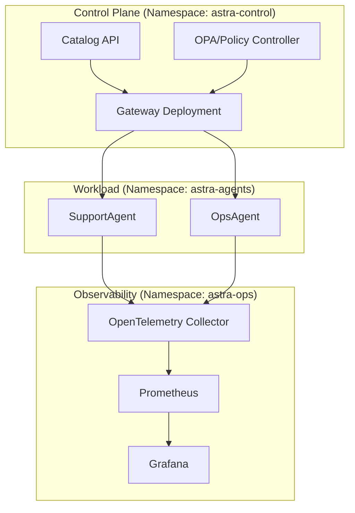

# 2. Architecture Overview

> AstraDesk separates **control** (Gateway, Catalog, Policy) from **execution** (Agents + Tools) and **evidence** (AstraOps).  
> Version: Framework 1.0 (single-agent focus with human-in-the-loop).

## 2.1 Goals & Non-Goals (v1.0)
- **Goals**  
  - Secure, observable single-agent runtime (SupportAgent/OpsAgent).  
  - **MCP-first** integrations via AstraDesk Gateway (authZ, OPA, rate limits, audit).  
  - Telemetry & evaluations through **AstraOps** (traces, metrics, offline/online evals).  
  - **AstraCatalog** for ownership, risk posture, versions, certification artifacts.
- **Non-Goals**  
  - Multi-agent swarm orchestration (planned in v2.0).  
  - Self-modifying prompts in production without approval gates.  
  - Unbounded tool authority (all tools require explicit scope & side-effect class).

---

## 2.2 High-Level System Diagram
```mermaid
flowchart LR
  subgraph Clients["Clients & Integrations"]
    U1[Web Admin]:::c
    U2[Slack/Chat UI]:::c
    U3[Service APIs]:::c
  end

  subgraph Gateway["AstraDesk Gateway"]
    GI[MCP Ingress<br/>OIDC, RBAC, OPA, Rate Limits, Audit]
    GL[LLM Gateway<br/>Routing, Caching, Cost Metering]
  end

  subgraph Runtime["Agents Runtime"]
    A1[SupportAgent]:::a
    A2[OpsAgent]:::a
  end

  subgraph Ops["AstraOps"]
    T1[Traces/Logs/Metrics]
    E1[Evaluations<br/>(offline/online/in-loop)]
    D1[Dashboards/Alerts]
  end

  subgraph Catalog["AstraCatalog"]
    R1[Registry<br/>Agents/Tools/Prompts]
    P1[Policies & Risk Posture]
    C1[Certification Artifacts]
  end

  subgraph Data["Enterprise Data & Tools"]
    DB[(PostgreSQL 18)]
    VDB[(Vector/Graph DB)]
    OBJ[(Object Storage/S3)]
    BUS[(NATS/Kafka)]
    EXT[(External APIs via MCP)]
  end

  U1 --> GI
  U2 --> GI
  U3 --> GI

  GI --> A1
  GI --> A2
  GL --> A1

  A1 <-->|Traces| Ops
  A2 <-->|Traces| Ops

  A1 --> Data
  A2 --> Data

  Ops --> Catalog
  Catalog --> GI

  classDef c fill:#eef,stroke:#88f,color:#000;
  classDef a fill:#efe,stroke:#2a6,color:#000;
````

---

## 2.3 Component Responsibilities

### AstraDesk Gateway

* **Identity & Access**: OIDC/OAuth2 for agents & tools; per-tool RBAC with parameter allow-lists.
* **Policy Enforcement**: OPA/Rego guardrails; environment routing (dev/stage/prod).
* **Rate Limiting & Quotas**: per tenant/agent/tool; backpressure & circuit breakers.
* **Audit**: all MCP tool invocations signed with request/response digests.

### Agents Runtime (SupportAgent/OpsAgent)

* **Reasoning & Planning** (v1.0): deterministic planner + LLM option; explicit **acceptable agency** bounds.
* **Memory**: ephemeral task memory with TTL; optional vector/graph lookups (read-only by default).
* **Tooling**: MCP tools with declared side effects (`read|write|execute`) and schemas.
* **Human-in-the-loop**: approval checkpoints for `write/execute` actions.

### AstraOps

* **Traces** of agentic flows: prompt → plan → tool calls → side effects → answer.
* **Metrics**: p95 latency, tool-success, groundedness proxy, cost per task.
* **Evaluations**: CI/offline, production/online and **in-loop** gates (e.g., context relevance).

### AstraCatalog

* **Registry**: agents, tools, prompts, datasets, model routes.
* **Risk & Policies**: per agent version; change controls; kill-switch metadata.
* **Certification**: artifacts for go-live (eval results, red-team notes, SBOM pointers).

### Data & Tools

* **PostgreSQL 18**: system of record (read/write via governed tools).
* **Vector/Graph DB**: retrieval & relations; read-only in v1.0 by default.
* **Buses**: NATS/Kafka for events & async jobs; idempotent handlers.
* **External APIs**: only via registered MCP servers with scoped tokens.

---

## 2.4 Sequence: Request → Result (Happy Path)

```mermaid
sequenceDiagram
  participant C as Client
  participant GW as AstraDesk Gateway
  participant AG as Agent
  participant TS as MCP Tool Server
  participant OP as AstraOps

  C->>GW: Request (JWT, context)
  GW->>AG: Dispatch (scoped auth + policies)
  AG->>AG: Plan (deterministic/LLM)
  AG->>GW: invoke(tool, args, side_effect)
  GW->>TS: Scoped call + OPA check
  TS-->>GW: Result
  GW-->>AG: Result + audit id
  AG->>OP: Traces + Metrics
  AG-->>C: Final answer (explanation optional)
```

---

## 2.5 Deployment Views (Kubernetes/EKS)



---

## 2.6 Security Posture (v1.0)

* **Least Privilege** for each MCP tool; explicit side-effect class enforced at gateway.
* **Environment Isolation**: dev/stage/prod with separate credentials & policy bundles.
* **Supply Chain**: signed container images; SBOM attached; admission policies block unknown digests.
* **Data**: secrets in manager (KMS/ASM), PII filters at ingress, egress allow-lists.

---

## 2.7 Observability Model

* **Traces**: span per plan step and per tool call; correlation IDs across gateway/agent/tool.
* **Metrics**: SLOs (p95 latency), business KPIs (containment, resolution), safety KPIs (policy violations).
* **Dashboards**: operator and owner views; triage → RCA playbooks; alert fatigue control.

---

## 2.8 Extensibility & Roadmap Hooks

* **Multi-agent orchestration** via policy-aware router (v2.0).
* **AstraGraph Memory** with temporal decay and relation-aware retrieval (v2.0).
* **Cost-aware model routing** (p95 + price caps) at LLM Gateway.

---

## 2.9 Cross-References

* Next: [3. Plan Phase](03_plan_phase.md)
* Previous: [1. Introduction](01_introduction.md)
* See also: [8. Security & Governance](08_security_governance.md), [7. Monitor & Operate](07_monitor_operate.md)

<br>