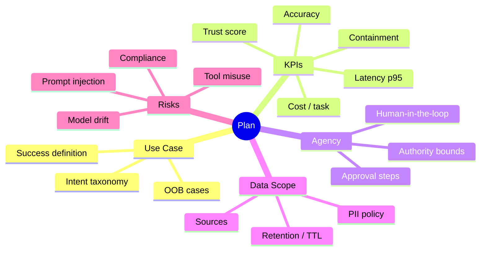

# 3. Plan Phase — Use Case, KPIs, Acceptable Agency

> Plan with **business outcomes** and **acceptable agency** in mind.  
> Output of this phase: Use Case Charter, KPI contract, data access scope, and risk register.

<br>

<br>

---

## 3.1 Planning Mind-Map

<br>



<br>

<br>

---

## 3.2 Use Case Charter (template)

Use this charter for each agent (v1.0 focuses on **single-agent**).

<br>

```yaml
# file: charters/support_agent.yaml
id: support-agent
owner: support.platform@company.com
mission: >
  Resolve Tier-1 support intents (auth, password, access) via KB retrieval and
  create/route tickets when needed, with safe approvals for write-actions.
kpis:
  accuracy_target: 0.85           # Offline eval correctness
  latency_p95_seconds: 8
  cost_per_task_usd: 0.03
  containment_rate: 0.60          # % resolved without human handoff
  trust_score_target: 0.80
acceptable_agency:
  max_side_effect: read            # default; escalate for write/execute
  approvals:
    - action: jira.create_issue
      approver_group: support.leads
      sla_seconds: 120
data_scope:
  readonly:
    - postgres: service_db.public_kb
    - vector: kb_embeddings.v1
  pii_filters:
    - email
    - phone
    - password_tokens
  retention:
    short_term_memory_ttl_minutes: 60
risks:
  - name: prompt_injection
    mitigation: prompt firewall + allow-list tools
  - name: data_leakage
    mitigation: PII scrub at ingress + OPA policy
rollout:
  envs: [dev, stage, prod]
  gates:
    - offline_evals
    - security_scan
    - approval_check
```

<br>

---

## 3.3 KPI Contract (machine-readable)

A small, declarative “contract” that AstraOps can load to enforce SLOs and alerting.

<br>

```json
{
  "agent_id": "support-agent",
  "version": "1.0.0",
  "kpi_contract": {
    "accuracy_min": 0.85,
    "latency_p95_max_seconds": 8,
    "cost_per_task_max_usd": 0.03,
    "containment_min": 0.60,
    "trust_score_min": 0.80
  },
  "alerting": {
    "channels": ["slack://#agent-ops", "email://agent-owners@company.com"],
    "rules": [
      {"metric": "latency_p95", "op": ">", "value": 8, "for": "5m"},
      {"metric": "containment", "op": "<", "value": 0.6, "for": "30m"}
    ]
  }
}
```

<br>

---

## 3.4 Acceptable Agency & Approvals

* **Default**: `read` side-effects only.

* Any `write/execute` requires approval (explicit approver or group), logged to **AstraOps** and **AstraCatalog**.

<br>

**OPA (policy-as-code) sample:**

<br>

```rego
package astra.plan.agency

default allow = false

# reads allowed for authenticated agents
allow {
  input.tool.side_effect == "read"
  input.auth.role != ""
}

# writes require explicit approval attachment in context
allow {
  input.tool.side_effect == "write"
  input.context.approval == true
  input.auth.role == "support.agent"
}
```

<br>

---

## 3.5 Data Access Scope (read-first posture)

* **PostgreSQL 18**: only schemas listed in charter (`service_db.public_kb`).

* **Vector/Graph DB**: retrieval only (no writes in v1.0).

* **External APIs**: only through registered **MCP** servers with scoped tokens.

* **PII handling**: ingress scrub + egress allow-lists.

<br>

**Ingress scrub config (example):**

<br>

```yaml
# file: gateway/pii_scrub.yaml
filters:
  - type: email
  - type: phone
  - type: secrets
actions:
  on_detect: redact
  log_event: true
```

<br>

---

## 3.6 Risk Register (living document)

Track risks with owners and tests.

<br>

```yaml
# file: risks/support_agent_risks.yaml
risks:
  - id: R1
    name: prompt_injection
    owner: sec.arch@company.com
    severity: high
    test:
      type: redteam_promptset
      path: tests/redteam/prompt_injection.jsonl
  - id: R2
    name: tool_misuse
    owner: agent.ops@company.com
    severity: medium
    test:
      type: simulation
      path: tests/simulations/tool_side_effects.yaml
```

<br>

---

## 3.7 Planning Checklist (tick before Build)

* [ ] Charter completed and approved by owner & security.

* [ ] KPI contract published to AstraOps.

* [ ] Acceptable agency documented; approval paths agreed.

* [ ] Data scope defined; PII filters configured.

* [ ] Risks logged with tests; owners assigned.

* [ ] Rollout environments and gates (evals, security, approvals) defined.

<br>

---

## 3.8 Cross-References

* Next: [4. Build Phase](04_build_phase.md)

* Previous: [2. Architecture Overview](02_architecture_overview.md)

* See also: [8. Security & Governance](08_security_governance.md)

<br>