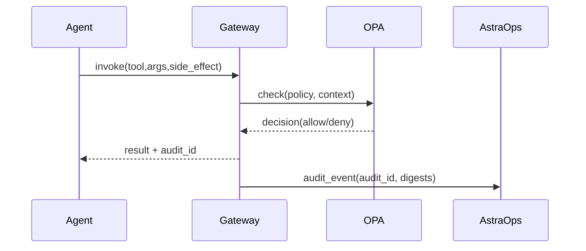
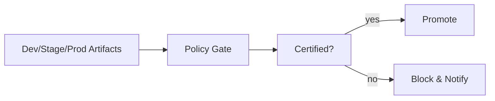

# 8. Security & Governance — RBAC, OPA, SBOM, Catalog

> Security is **built-in**, not bolted-on.  
> This chapter defines the **control plane**: identity, authorization, policy-as-code, data protection, supply-chain, and audit.

<br>

---

## 8.1 Principles (v1.0)

- **Least privilege by tool & parameter** (side-effects: `read|write|execute`).

- **Explicit approvals** for `write/execute` with human-in-the-loop.

- **Policy-as-code** (OPA/Rego) at **Gateway** + **Kubernetes admission**.

- **Separation of duties**: Gateway vs Agents vs MCP servers.

- **Evidence-first**: all decisions/audits into **AstraOps** & **AstraCatalog**.

<br>

<br>

---

## 8.2 Identity & Access

<br>

### 8.2.1 Identities
- **Agents**: OIDC client credentials (`client_id`, `client_secret` / workload identity).
- **MCP Tools**: service principals with **scoped tokens** (per environment).
- **Humans**: SSO (OIDC/SAML) mapped to RBAC roles.

<br>

### 8.2.2 Roles (examples)
| Role              | Purpose                                | Tool Authority             |
|-------------------|-----------------------------------------|----------------------------|
| `support.agent`   | Tier-1 support bot                      | `kb.search:read`, `jira.create_issue:write (approval)` |
| `ops.agent`       | Observability triage                    | `metrics.read:read`, `remediation.seq:execute (approval)` |
| `catalog.owner`   | Registry maintenance                    | Publish/approve artifacts  |
| `sec.arch`        | Security policy owner                   | Manage OPA bundles         |

---

## 8.3 Policy-as-Code (OPA/Rego)

### 8.3.1 Tool Side-Effect Gate (Gateway)
```rego
# file: policies/agent_tools.rego
package astra.gateway

default allow = false

# Allow reads for authenticated agents
allow {
  input.tool.side_effect == "read"
  input.auth.actor_type == "agent"
  input.auth.role != ""
}

# Writes require explicit role + approval flag in context
allow {
  input.tool.side_effect == "write"
  input.auth.role == "support.agent"
  input.context.approval == true
}

# Execute requires ops role and emergency flag
allow {
  input.tool.side_effect == "execute"
  input.auth.role == "ops.agent"
  input.context.change_record != ""    # incident/change id
}

# Block external tools when PII is present
deny[msg] {
  input.context.contains_pii == true
  startswith(input.tool.name, "external.")
  msg := "External tool blocked for PII"
}
````

### 8.3.2 Data Classification & Egress

```rego
# file: policies/data_egress.rego
package astra.egress

default permit = false
level := input.context.classification  # public|internal|confidential

permit {
  level == "public"
  input.destination in {"webhook.trustedA","webhook.trustedB"}
}

permit {
  level == "internal"
  input.destination == "slack.corp"
  not input.payload.contains_secrets
}

# deny everything else by default
```

> Bundle OPA policies and distribute via Gateway; version policies in **AstraCatalog**.

---

## 8.4 Kubernetes Admission (Gatekeeper/PSA)

### 8.4.1 Deny Privileged & Enforce Read-Only RootFS

```yaml
# file: policies/gatekeeper/deny-privileged.yaml
apiVersion: constraints.gatekeeper.sh/v1beta1
kind: K8sPSPPrivilegedContainer
metadata: { name: disallow-privileged }
spec:
  match:
    kinds:
      - apiGroups: [""]
        kinds: ["Pod"]
```

```yaml
# file: policies/gatekeeper/readonly-rootfs.yaml
apiVersion: constraints.gatekeeper.sh/v1beta1
kind: K8sPSPReadOnlyRootFilesystem
metadata: { name: enforce-readonly-rootfs }
spec:
  match:
    namespaces: ["astra-agents"]
```

> On modern clusters prefer **Pod Security Admission (restricted)** namespace labels or **OpenShift SCC** equivalents.

---

## 8.5 Supply Chain: SBOM, Signing, Provenance

### 8.5.1 SBOM & Image Scan (CI)

```bash
# Generate SBOM (Syft) and scan (Trivy)
syft ghcr.io/org/astradesk/support-agent:${GIT_SHA} -o spdx-json > sbom.spdx.json
trivy image --exit-code 1 ghcr.io/org/astradesk/support-agent:${GIT_SHA} || true
```

### 8.5.2 Sign & Verify (cosign)

```bash
# Sign
cosign sign --key $COSIGN_KEY ghcr.io/org/astradesk/support-agent:${GIT_SHA}

# Verify in admission controller or deploy job
cosign verify --key $COSIGN_PUB ghcr.io/org/astradesk/support-agent:${GIT_SHA}
```

### 8.5.3 Catalog Certification

* Upload SBOM, scan reports, cosign bundle to **AstraCatalog**.
* Gate deployment on **Catalog Certified = true**.

---

## 8.6 Secrets & Encryption

* **Secrets Manager** (AWS Secrets Manager/KMS; OpenShift: sealed-secrets).
* **Never** bake credentials into images or ConfigMaps.
* **In transit**: mTLS Gateway↔Agent↔MCP; rotate certs.
* **At rest**: KMS-encrypted volumes/buckets; per-env keys.
* **Token scope**: narrow, short-lived; audience & TTL checks at Gateway.

---

## 8.7 Data Protection & PII

### 8.7.1 Ingress Scrub (Gateway)

```yaml
# file: gateway/pii_scrub.yaml
filters:
  - type: email
  - type: phone
  - type: secrets
actions:
  on_detect: redact
  log_event: true
```

### 8.7.2 Egress Allow-List

```yaml
# file: gateway/egress.yaml
allowed_destinations:
  - slack.corp
  - webhook.trustedA
block_patterns:
  - "http://*"
  - "https://unknown.*"
```

---

## 8.8 Auditing & Forensics

* **Audit event per tool call**: tool name, args schema hash, side-effect, result hash, approval id.
* **Trace correlation**: `x-astradesk-trace-id`, `x-gateway-audit-id`.
* **Retention**: ≥ 90d for prod; ≥ 1y for critical approvals (per compliance).
* **Tamper-evidence**: store hashes in immutable log or append-only object storage.



---

## 8.9 Governance in AstraCatalog

* **Registry**: agents, tools, prompts, datasets, policies (with owners).
* **Risk Posture**: per agent version (data classes, tool authority, approvals).
* **Release Artifacts**: eval results, red-team notes, SBOM, signatures.
* **Kill Switch**: per agent → immediate disable in Gateway.



---

## 8.10 Threat Model (quick)

| Threat                     | Control                                                         |       |                       |
| -------------------------- | --------------------------------------------------------------- | ----- | --------------------- |
| **Prompt injection**       | Prompt firewall + OPA tool allow-list + context relevance guard |       |                       |
| **Tool misuse/over-reach** | Side-effect gating (`read                                       | write | execute`) + approvals |
| **PII leakage**            | Ingress scrub, egress allow-list, deny external tools with PII  |       |                       |
| **Credential exposure**    | Secrets manager + short-lived tokens + no env dumps             |       |                       |
| **Image tampering**        | SBOM + scan + cosign verify in admission                        |       |                       |
| **Policy bypass**          | Centralized Gateway; deny direct tool access; immutable audit   |       |                       |

---

## 8.11 Minimal Compliance Mapping

* **ISO 27001**: A.9 (Access), A.12 (Ops), A.14 (SDLC), A.18 (Compliance).
* **SOC 2**: Security, Availability, Confidentiality trust criteria.
* **GDPR**: Data minimization, purpose limitation, access logging, retention.

---

## 8.12 Operational Checklists

* [ ] OPA bundles loaded & versioned; deny by default for unknown tools.
* [ ] Gatekeeper/PSA **restricted** enforced in namespaces.
* [ ] Images signed & verified; SBOM stored in Catalog.
* [ ] Secrets pulled at runtime via manager; rotations tested.
* [ ] PII scrub + egress allow-list live; synthetic tests passing.
* [ ] Audit trail searchable by `trace_id` and `audit_id`.

---

## 8.13 Cross-References

* Next: [9. MCP Gateway & Domain Packs](09_mcp_gateway_domain_packs.md)
* Previous: [7. Monitor & Operate](07_monitor_operate.md)
* See also: [3. Plan Phase](03_plan_phase.md) — acceptable agency & data scope

<br>
