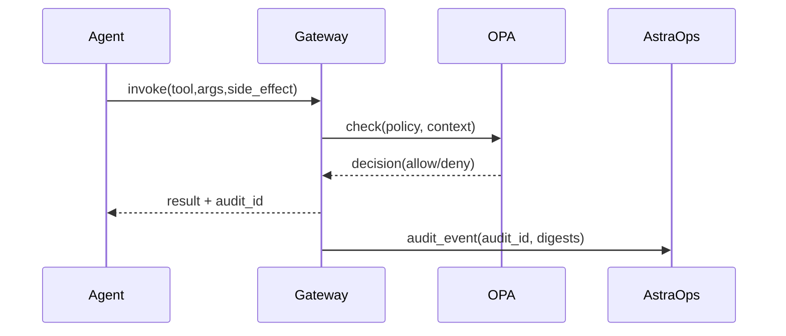
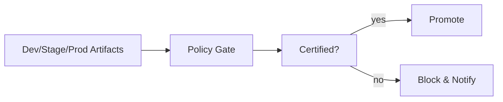

<!--
SPDX-License-Identifier: GPL-2.0-only
Project: AstraDesk
File: docs/en/08_security_governance.md
Website: https://www.astradesk.dev
Repository: https://github.com/SSobol77/astradesk

Description: Documents AstraDesk architecture, operation, or component behavior.

Copyright (c) 2026 Siergej Sobolewski
This file is part of AstraDesk.

AstraDesk is licensed under the GNU General Public License version 2 only.
See the LICENSE file in the project root for the full license text.
-->


# 8. Security & Governance - RBAC, OPA, SBOM, Catalog

> Security is **built-in**, not bolted-on.  
> This chapter defines the **control plane**: identity, authorization, policy-as-code, data protection, supply-chain, and audit.

<br>

---

## 8.1 Principles (v1.0)

- **Least privilege by tool & parameter** (side-effects: `read|write|execute`).

- **Explicit approvals** for `write/execute` with human-in-the-loop.

- **Policy-as-code** (OPA/Rego) at **Gateway** + **Kubernetes admission**.

- **Separation of duties**: Gateway vs Agents vs MCP servers.

- **Evidence-first**: all decisions/audits into **AstraOps** & **AstraCatalog**.

<br>

<br>

---

## 8.2 Identity & Access

<br>

### 8.2.1 Identities

- **Agents**: OIDC client credentials (`client_id`, `client_secret` / workload identity).

- **MCP Tools**: service principals with **scoped tokens** (per environment).

- **Humans**: SSO (OIDC/SAML) mapped to RBAC roles.

<br>

### 8.2.2 Roles (examples)

| Role              | Purpose                                | Tool Authority             |
|-------------------|-----------------------------------------|----------------------------|
| `support.agent`   | Tier-1 support bot                      | `kb.search:read`, `jira.create_issue:write (approval)` |
| `ops.agent`       | Observability triage                    | `metrics.read:read`, `remediation.seq:execute (approval)` |
| `catalog.owner`   | Registry maintenance                    | Publish/approve artifacts  |
| `sec.arch`        | Security policy owner                   | Manage OPA bundles         |

<br>

---

## 8.3 Policy-as-Code (OPA/Rego)

<br>

### 8.3.1 Tool Side-Effect Gate (Gateway)

```rego
# file: policies/agent_tools.rego
package astra.gateway

default allow = false

# Allow reads for authenticated agents
allow {
  input.tool.side_effect == "read"
  input.auth.actor_type == "agent"
  input.auth.role != ""
}

# Writes require explicit role + approval flag in context
allow {
  input.tool.side_effect == "write"
  input.auth.role == "support.agent"
  input.context.approval == true
}

# Execute requires ops role and emergency flag
allow {
  input.tool.side_effect == "execute"
  input.auth.role == "ops.agent"
  input.context.change_record != ""    # incident/change id
}

# Block external tools when PII is present
deny[msg] {
  input.context.contains_pii == true
  startswith(input.tool.name, "external.")
  msg := "External tool blocked for PII"
}
````

<br>

### 8.3.2 Data Classification & Egress

```rego
# file: policies/data_egress.rego
package astra.egress

default permit = false
level := input.context.classification  # public|internal|confidential

permit {
  level == "public"
  input.destination in {"webhook.trustedA","webhook.trustedB"}
}

permit {
  level == "internal"
  input.destination == "slack.corp"
  not input.payload.contains_secrets
}

# deny everything else by default
```

> Bundle OPA policies and distribute via Gateway; version policies in **AstraCatalog**.

<br>

---

## 8.4 Kubernetes Admission (Gatekeeper/PSA)

<br>

### 8.4.1 Deny Privileged & Enforce Read-Only RootFS

```yaml
# file: policies/gatekeeper/deny-privileged.yaml
apiVersion: constraints.gatekeeper.sh/v1beta1
kind: K8sPSPPrivilegedContainer
metadata: { name: disallow-privileged }
spec:
  match:
    kinds:
      - apiGroups: [""]
        kinds: ["Pod"]
```

```yaml
# file: policies/gatekeeper/readonly-rootfs.yaml
apiVersion: constraints.gatekeeper.sh/v1beta1
kind: K8sPSPReadOnlyRootFilesystem
metadata: { name: enforce-readonly-rootfs }
spec:
  match:
    namespaces: ["astra-agents"]
```

> On modern clusters prefer **Pod Security Admission (restricted)** namespace labels or **OpenShift SCC** equivalents.

<br>

---

## 8.5 Supply Chain: SBOM, Signing, Provenance

<br>

### 8.5.1 SBOM & Image Scan (CI)

```bash
# Generate SBOM (Syft) and scan (Trivy)
syft ghcr.io/org/astradesk/support-agent:${GIT_SHA} -o spdx-json > sbom.spdx.json
trivy image --exit-code 1 ghcr.io/org/astradesk/support-agent:${GIT_SHA} || true
```

<br>

### 8.5.2 Sign & Verify (cosign)

```bash
# Sign
cosign sign --key $COSIGN_KEY ghcr.io/org/astradesk/support-agent:${GIT_SHA}

# Verify in admission controller or deploy job
cosign verify --key $COSIGN_PUB ghcr.io/org/astradesk/support-agent:${GIT_SHA}
```

<br>

### 8.5.3 Catalog Certification

- Upload SBOM, scan reports, cosign bundle to **AstraCatalog**.

- Gate deployment on **Catalog Certified = true**.

<br>

### 8.5.4 Fail-Closed Dependency & Image Scan Gate (Track A, issue #40)

The §8.5.1 SBOM/sign/Catalog flow above is the Track B enterprise pipeline
(full SBOM publishing, cosign signing, digest-verified promotion) and is not
yet wired into CI. Issue #40 (`docs/roadmap/issues/ISSUES_NEW-01_supply_chain.md`,
NEW-01) implements the narrower Track A gate that **is** wired into CI today:

- `scripts/ci/supply_chain_scan.sh <image-ref> [<image-ref> ...]` runs
  `trivy image --severity HIGH,CRITICAL --exit-code 1` against each
  already-built image and fails the job on any unaccepted finding. It treats
  a missing `trivy` binary as a gate failure, not a skip (INV-FAIL-CLOSED) —
  a supply-chain gate that silently no-ops when its scanner is absent is not
  a control.
- `.github/workflows/ci.yml` invokes it once per built image
  (`astradesk:ci-python`, `astradesk:ci-java`, `astradesk:ci-js`) immediately
  after that image's existing `docker build` step, so no new network-heavy
  scan runs before the normal lint/type/test gates.
- `.trivyignore` at the repository root is the accepted-risk allow-list. Every
  active entry must be a documented false positive or a proven
  **non-reachable** finding, with an `exp:YYYY-MM-DD` expiry
  (INV-SC-4 — Trivy re-fails the gate once an entry expires). It must never
  be used to silence a real, reachable HIGH/CRITICAL finding; those must be
  remediated (dependency bump on a tested constraint set, not a blind
  mass-update — see the issue's own "childhood disease" framing).
- `audit/evidence/19_pip_audit.txt` and `audit/evidence/40_dependency_triage.md`
  record the current `pip-audit` advisory list and its reachability
  disposition (remediated / not-present-in-runtime-image /
  accepted-with-expiry / pending) per INV-SC-1. As of this writing several
  reachable findings (`transformers`, `torch`, `starlette` via `fastapi`,
  `urllib3`, `cryptography`) remain **pending** a dedicated,
  resolver-tested remediation pass — the gate is expected to fail on
  `astradesk:ci-python` until that lands; that is the gate working as
  designed, not a defect in it.
- A GitLab CI equivalent is intentionally **not** wired into the multi-arch
  `build:images` stage in this pass (that stage pushes to a real registry and
  signs with cosign; bolting an unvalidated new dependency onto it was judged
  higher-risk than deferring). The same
  `scripts/ci/supply_chain_scan.sh` script is the intended integration point
  once that stage is extended — see the comment left in `.gitlab-ci.yml`.
- Scoping the root `Dockerfile`'s `uv sync --all-extras --frozen` down to
  `--frozen --no-dev --package astradesk-api-gateway` (matching every sibling
  service Dockerfile) was investigated and proven, by Trivy diff, to remove
  several dev/docs/test-only findings from `astradesk:ci-python` — including
  the image's sole CRITICAL Python-package finding. It is **not applied**:
  the rebuilt image was run with its real entrypoint and found to fail at
  startup (`ModuleNotFoundError: No module named 'agents'`), and the
  unmodified image fails identically — a pre-existing, unrelated
  Dockerfile/editable-install path defect, not a supply-chain issue. See
  `audit/evidence/40_dependency_triage.md` for the full investigation and
  the narrow fix it points to.

<br>

---

## 8.6 Secrets & Encryption

- **Secrets Manager** (AWS Secrets Manager/KMS; OpenShift: sealed-secrets).

- **Never** bake credentials into images or ConfigMaps.

- **In transit**: mTLS Gateway↔Agent↔MCP; rotate certs.

- **At rest**: KMS-encrypted volumes/buckets; per-env keys.

- **Token scope**: narrow, short-lived; audience & TTL checks at Gateway.

<br>

---

## 8.7 Data Protection & PII

<br>

### 8.7.1 Ingress Scrub (Gateway)

```yaml
# file: gateway/pii_scrub.yaml
filters:
  - type: email
  - type: phone
  - type: secrets
actions:
  on_detect: redact
  log_event: true
```

<br>

### 8.7.2 Egress Allow-List

```yaml
# file: gateway/egress.yaml
allowed_destinations:
  - slack.corp
  - webhook.trustedA
block_patterns:
  - "http://*"
  - "https://unknown.*"
```

<br>

---

## 8.8 Auditing & Forensics

- **Audit event per tool call**: tool name, args schema hash, side-effect, result hash, approval id.

- **Trace correlation**: `x-astradesk-trace-id`, `x-gateway-audit-id`.

- **Retention**: ≥ 90d for prod; ≥ 1y for critical approvals (per compliance).

- **Tamper-evidence**: store hashes in immutable log or append-only object storage.

<br>


```mermaid
sequenceDiagram
  participant AG as Agent
  participant GW as Gateway
  participant OPA as OPA
  participant OP as AstraOps

  AG->>GW: invoke(tool,args,side_effect)
  GW->>OPA: check(policy, context)
  OPA-->>GW: decision(allow/deny)
  GW-->>AG: result + audit_id
  GW->>OP: audit_event(audit_id, digests)
```

<br>

<br>

---

## 8.9 Governance in AstraCatalog

- **Registry**: agents, tools, prompts, datasets, policies (with owners).

- **Risk Posture**: per agent version (data classes, tool authority, approvals).

- **Release Artifacts**: eval results, red-team notes, SBOM, signatures.

- **Kill Switch**: per agent → immediate disable in Gateway.

<br>


```mermaid
flowchart LR
  Dev[Dev/Stage/Prod Artifacts] --> Gate[Policy Gate]
  Gate --> Catalog[Certified?]
  Catalog -->|yes| Release[Promote]
  Catalog -->|no| Block[Block & Notify]
```

<br>

<br>

---

## 8.10 Threat Model (quick)

<br>

| Threat                     | Control                                                         |       |                       |
| -------------------------- | --------------------------------------------------------------- | ----- | --------------------- |
| **Prompt injection**       | Prompt firewall + OPA tool allow-list + context relevance guard |       |                       |
| **Tool misuse/over-reach** | Side-effect gating (`read                                       | write | execute`) + approvals |
| **PII leakage**            | Ingress scrub, egress allow-list, deny external tools with PII  |       |                       |
| **Credential exposure**    | Secrets manager + short-lived tokens + no env dumps             |       |                       |
| **Image tampering**        | SBOM + scan + cosign verify in admission                        |       |                       |
| **Policy bypass**          | Centralized Gateway; deny direct tool access; immutable audit   |       |                       |

<br>

---

## 8.11 Minimal Compliance Mapping

- **ISO 27001**: A.9 (Access), A.12 (Ops), A.14 (SDLC), A.18 (Compliance).

- **SOC 2**: Security, Availability, Confidentiality trust criteria.

- **GDPR**: Data minimization, purpose limitation, access logging, retention.

<br>

---

## 8.12 Operational Checklists

- [ ] OPA bundles loaded & versioned; deny by default for unknown tools.

- [ ] Gatekeeper/PSA **restricted** enforced in namespaces.

- [ ] Images signed & verified; SBOM stored in Catalog.

- [ ] Secrets pulled at runtime via manager; rotations tested.

- [ ] PII scrub + egress allow-list live; synthetic tests passing.

- [ ] Audit trail searchable by `trace_id` and `audit_id`.

<br>

---

## 8.13 Admin API Defense-in-Depth (NEW-SEC)

The Admin API (`services/admin_api`) and its API Gateway proxy route
(`/api/admin/v1/{path}`) are each independently guarded. Neither layer trusts
network placement, Docker Compose isolation, or the other layer's decision as
a substitute for its own check.

**Layer 1 — API Gateway proxy.** `/api/admin/v1/{path:path}`
(`services/api-gateway/src/gateway/main.py`) requires an authenticated
principal (OIDC Bearer JWT, ISSUE 009) with the normalized `admin` role before
forwarding anything upstream:

- Missing or malformed `Authorization` → `401`, upstream is never called.
- Authenticated principal without `admin` → `403`, upstream is never called.
- Authenticated `admin` → the request is proxied. Caller-supplied
  `X-AstraDesk-*` headers (`X-AstraDesk-Principal`, `X-AstraDesk-Tenant`,
  `X-AstraDesk-Roles`, and any other `X-AstraDesk-*` header) are stripped
  before forwarding — **these headers are never a valid authentication
  mechanism**, only the verified `Authorization` bearer token is. That header
  is forwarded unchanged, and only because Layer 2 independently re-verifies
  it (see below) rather than trusting the Gateway's decision.

**Layer 2 — Admin API.** `services/admin_api/src/astradesk_admin/auth.py`
independently verifies the same Bearer JWT (via the shared
`astradesk_core.utils.oidc` verifier, ISSUE 009's contract, not a redesign)
and independently requires the normalized `admin` role, regardless of what
the Gateway already decided:

- Missing or invalid Bearer JWT → `401`.
- Authenticated principal without `admin` → `403`.
- `X-AstraDesk-*` headers are never read as identity by the Admin API; only a
  verified Bearer JWT establishes a principal.

**Public exceptions.** `GET /health` (liveness/dashboard status — no secrets,
credentials, or per-user data) and FastAPI's auto-generated `/docs`, `/redoc`,
`/openapi.json` (API shape only, no live data) remain unauthenticated. Every
other Admin API operation requires `admin`.

**Contract.** `openapi/astradesk-admin.v1.yaml` declares a `BearerAuth`
(`http`/`bearer`/`JWT`) security scheme and applies it to every protected
operation, so the requirement is visible in the OpenAPI contract, not only in
code.

**Not yet implemented (future hardening).** Service-to-service mTLS and
Istio `AuthorizationPolicy` between the Gateway and the Admin API remain the
network-layer requirement described elsewhere in this document (§8.6); this
defense-in-depth work adds the application-layer guard on top of that and
does not replace it. Signed internal service-identity tokens (as an
alternative to the currently-stripped `X-AstraDesk-*` headers) are not
implemented and are not required for the current invariant set.

<br>

---

## 8.14 Cross-References

- Next: [9. MCP Gateway & Domain Packs](09_mcp_gateway_domain_packs.md)

- Previous: [7. Monitor & Operate](07_monitor_operate.md)

- See also: [3. Plan Phase](03_plan_phase.md) - acceptable agency & data scope

<br>
