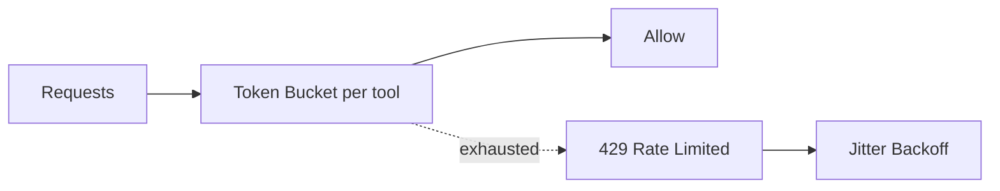

# 9. MCP Gateway & Domain Packs

> AstraDesk treats **all integrations** as **MCP servers** with governed tools/resources/prompts.  
> The **Gateway** centralizes authZ, policy, quotas, routing, and audit. **Domain Packs** bundle ready-to-use tools.

---

## 9.1 Gateway Responsibilities (v1.0)
- **AuthN/Z**: OIDC for agents; per-tool **RBAC** with parameter allow-lists.  
- **Policy**: OPA/Rego side-effect gates (`read|write|execute`), PII-aware egress rules.  
- **Routing**: env routing (dev/stage/prod), failover to fallback MCP.  
- **Quotas & Rate Limits**: per tenant/agent/tool; circuit breakers.  
- **Schema Registry**: JSON Schemas for each tool version; hash pinned at call time.  
- **Audit**: signed event for every tool call (args digest + result digest).  

<br>

```mermaid
sequenceDiagram
  autonumber
  participant AG as Agent
  participant GW as MCP Gateway
  participant OPA as Policy Engine (OPA)
  participant TS as Tool Server (MCP)
  participant OP as AstraOps

  AG->>GW: invoke(tool, args, side_effect, ctx)
  GW->>OPA: evaluate(policy, ctx, tool, side_effect)
  OPA-->>GW: allow/deny + reasons
  alt allowed
    GW->>TS: call with scoped token
    TS-->>GW: result (json)
    GW-->>AG: result + audit_id
    GW->>OP: audit_event(audit_id, digests, metrics)
  else denied
    GW-->>AG: error(policy_violation)
    GW->>OP: audit_event(denied)
  end
````

<br>

---

## 9.2 Gateway Config (YAML, example)

```yaml
# file: gateway/config.yaml
env: "prod"
oidc:
  issuer: "https://auth.company.com"
  audience: "astradesk-gateway"
rate_limits:
  default_rpm: 600
  per_tool:
    kb.search: 2400
    jira.create_issue: 120
policies:
  bundle_url: "s3://astracatalog/policies/bundle.tar.gz"
  deny_on_error: true
tools:
  - name: kb.search
    mcp: "https://mcp.kb.internal"
    side_effect: "read"
    schema_ref: "sha256:8a1c…"
  - name: jira.create_issue
    mcp: "https://mcp.jira.internal"
    side_effect: "write"
    schema_ref: "sha256:f3b0…"
fallbacks:
  kb.search: ["https://mcp.kb.backup"]
audit:
  sink: "kafka://astrabus/audit"
  hash_algo: "sha256"
  retention_days: 365
```

---

## 9.3 Audit Event (canonical)

```json
{
  "audit_id": "gw-2025-10-12T19:22:43Z-7f1c",
  "ts": "2025-10-12T19:22:43Z",
  "agent_id": "support-agent@1.0.1",
  "tool": { "name": "jira.create_issue", "side_effect": "write", "schema_hash": "sha256:f3b0…" },
  "auth": { "actor_type": "agent", "role": "support.agent", "tenant": "acme" },
  "ctx": { "env": "prod", "contains_pii": false, "approval_id": "APR-00123" },
  "args_digest": "sha256:9a62…",
  "result_digest": "sha256:1b7c…",
  "decision": { "allow": true, "policy_bundle": "v2025.10.01" },
  "latency_ms": 412
}
```

---

## 9.4 Error Taxonomy (Gateway → Agent)

| code                   | http | meaning                           | action                          |
| ---------------------- | ---: | --------------------------------- | ------------------------------- |
| `policy_violation`     |  403 | OPA denied (side-effect/PII/etc.) | show reason, propose escalation |
| `rate_limited`         |  429 | quota exceeded                    | retry with backoff              |
| `schema_mismatch`      |  422 | args didn’t match tool schema     | fix args; re-plan               |
| `upstream_unavailable` |  503 | MCP server down                   | failover/queue                  |
| `timeout`              |  504 | exceeded server SLA               | reduce `top_k`/payload, retry   |
| `auth_failed`          |  401 | token invalid/expired             | refresh token                   |

---

## 9.5 Domain Packs (v1.0)

### 9.5.1 Support Pack

**Purpose**: Tier-1 support automation.

**Included MCP tools**

* `kb.search (read)` — KB/FAQ retrieval (vector/graph backends supported).
* `jira.create_issue (write)` — create ticket with labels/priority (approval).
* `slack.post_message (write)` — post to channel with templates (approval).

**Schemas (extracts)**

```json
{
  "$id": "mcp/schemas/slack.post_message.schema.json",
  "$schema": "https://json-schema.org/draft/2020-12/schema",
  "title": "slack.post_message",
  "type": "object",
  "properties": {
    "channel": { "type": "string", "pattern": "^#[a-z0-9_-]+$" },
    "text":    { "type": "string", "minLength": 1 }
  },
  "required": ["channel","text"],
  "additionalProperties": false
}
```

**Pack install (Catalog manifest)**

```yaml
# file: catalog/packs/support.yaml
pack: support
version: 1.0.0
owners: ["support.platform@company.com"]
tools:
  - name: kb.search
    side_effect: read
    schema_ref: "sha256:8a1c…"
  - name: jira.create_issue
    side_effect: write
    schema_ref: "sha256:f3b0…"
  - name: slack.post_message
    side_effect: write
    schema_ref: "sha256:7aa9…"
policies:
  require_approval_for:
    - jira.create_issue
    - slack.post_message
```

---

### 9.5.2 Ops Pack

**Purpose**: Ops triage with guarded remediations.

**Included MCP tools**

* `metrics.query (read)` — query Prometheus for SLOs.
* `remediation.seq (execute)` — approved, idempotent runbooks (e.g., scale deployment).

**Remediation descriptor**

```yaml
# file: ops/remediations/scale_support_agent.yaml
id: scale_support_agent
owner: "ops@company.com"
prechecks:
  - metric: "histogram_quantile(0.95, ... ) > 8"
  - tool: "k8s.get_deployment"         # read-only sanity check
steps:
  - tool: "k8s.patch_deployment"       # execute (requires change_record)
    args:
      name: "support-agent"
      replicas: 3
postchecks:
  - metric: "histogram_quantile(0.95, ... ) <= 8"
approvals:
  required: true
  change_record: "INC-2025-00123"
```

---

## 9.6 OpenAPI Shim (optional)

Expose a small REST surface **for non-MCP clients**; internally still call MCP.

```yaml
openapi: 3.1.0
info: { title: "AstraDesk Gateway Shim", version: "1.0.0" }
paths:
  /invoke:
    post:
      summary: Invoke a tool through Gateway
      requestBody:
        required: true
        content:
          application/json:
            schema:
              type: object
              required: [tool, args, side_effect]
              properties:
                tool: { type: string }
                side_effect: { type: string, enum: [read, write, execute] }
                args: { type: object, additionalProperties: true }
      responses:
        "200": { description: "Tool result" }
        "4XX": { description: "Policy/Schema error" }
        "5XX": { description: "Upstream error" }
```

---

## 9.7 Rate Limiting & Quotas (design)

* **Hierarchies**: tenant → agent → tool.
* **Windows**: fixed or token-bucket; per env.
* **Burst controls**: circuit breaker opens on consecutive failures.
* **Backoff**: jittered exponential backoff guidance sent to agent.



---

## 9.8 Security Notes

* All **write/execute** tools must include an **approval_id** or **change_record** in context.
* **PII flag** propagates from ingress scrubber to Gateway; blocks `external.*` tools.
* **Schema pinning**: agent includes `schema_hash`; Gateway rejects if mismatch.

---

## 9.9 Operational Dashboards (suggested)

* **Gateway**: RPS, error rate, p95, open circuits, deny reasons by policy rule.
* **Tools**: success rate by tool version, latency distribution, fallback hits.
* **Audit**: top write-actions by agent/version; approvals over time.

---

## 9.10 Cross-References

* Next: [10. Future Roadmap](10_future_roadmap.md)
* Previous: [8. Security & Governance](08_security_governance.md)
* See also: [7. Monitor & Operate](07_monitor_operate.md), [4. Build Phase](04_build_phase.md)

<br>
