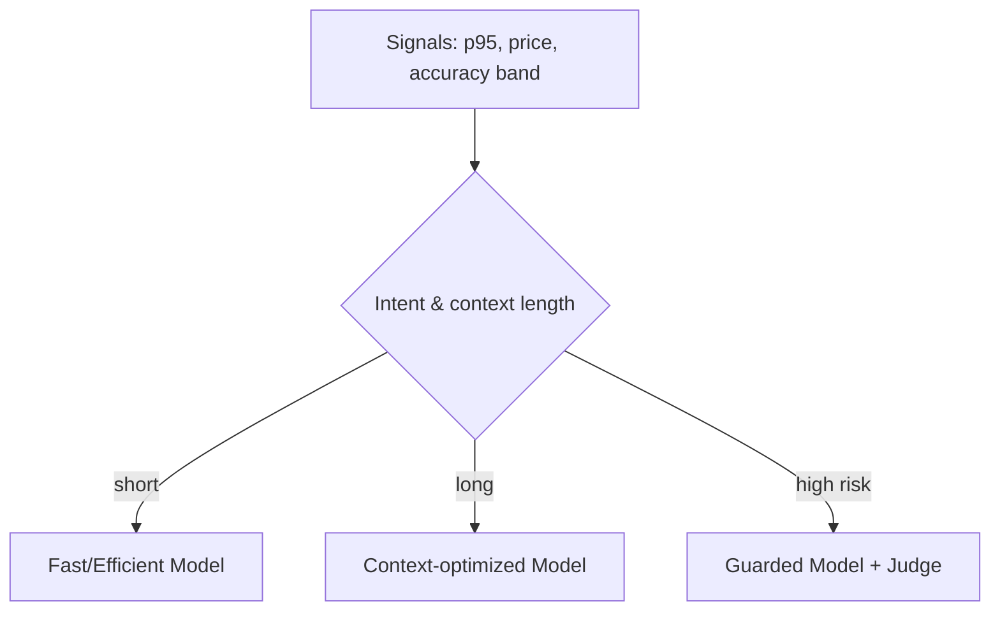

# 10. Future Roadmap - v2.0 and Beyond

> This roadmap outlines evolution from **single-agent (v1.0)** to **policy-aware multi-agent systems (v2.0+)** with richer memory, autonomous evals, and cost-aware routing. Timeline and scope may shift based on evidence from AstraOps.

<br>

---

## 10.1 Themes

- **Multi-Agent Orchestration**: role-based teams of agents with conversation-level policies and credits.

- **AstraGraph Memory**: hybrid vector + graph memory with temporal decay, provenance, and retention guards.

- **Self-Evaluating Flows**: LLM-as-a-Judge embedded as micro-policies; auto-labeling of production traces.

- **Shadow & Canary**: automatic challenger runs on mirrored traffic; rollback by policy if SLOs regress.

- **Cost-/SLO-Aware Routing**: dynamic model selection based on p95 latency, token price, and accuracy bands.

- **Stronger Governance**: cataloged *intents*, *prompts*, and *tool* versions as first-class release artifacts.

<br>

```mermaid
flowchart LR
  V1[AstraDesk 1.0\nSingle Agent] --> V2[AstraDesk 2.0\nMulti-Agent, Policy Router]
  V2 --> M1[AstraGraph Memory]
  V2 --> E1[Self Evals In-Loop]
  V2 --> C1[Shadow/Canary by Policy]
  V2 --> R1[Cost/SLO Model Router]
````

<br>

<br>

---

## 10.2 v2.0 Capabilities (planned)

<br>

### 10.2.1 Policy-Aware Multi-Agent Router

- **Orchestration**: Planner, Researcher, Toolsmith, and Explainer roles.

- **Conversation Contracts**: max tool side-effects per role; per-dialog credit budget.

- **Negotiation Primitives**: propose/accept/decline with audit events.

<br>

```mermaid
sequenceDiagram
  autonumber
  participant CL as Client
  participant RT as Policy Router
  participant PR as Planner
  participant RS as Researcher
  participant EX as Explainer

  CL->>RT: goal + context
  RT->>PR: assign(plan, limits)
  PR-->>RT: plan(tool graph)
  RT->>RS: fetch(context chunks)
  RS-->>RT: evidence + citations
  RT->>EX: compose(answer within policy)
  EX-->>CL: final answer + provenance
```

<br>

<br>

---

### 10.2.2 AstraGraph Memory

- **Graph Core**: entities, intents, documents, tools; edges carry **recency**, **confidence**, **policy tags**.

- **Temporal Decay**: decrease weight of stale nodes; prioritize fresh evidence.

- **Provenance**: each memory node carries source digest & retention policy.

<br>

**Memory API (concept):**

```yaml
# memory/read.yaml
query:
  entities: ["user:X", "app:astradesk"]
  k: 8
  filters:
    - tag: "public"
    - decay_t_half_days: 14
returns: nodes + edges + citations
```

<br>

---

### 10.2.3 Self-Evaluating Flows

- **Judge Kernels**: pluggable, per-task rubrics (helpfulness, groundedness, safety).

- **Auto-Labeling**: subset of live traces graded; results feed regression datasets.

- **Guardrails**: deny compose step when judge score < thresholds.

```python
# pseudo: judge micro-gate
scores = judge_kernel(context, draft_answer)
if scores["groundedness"] < 0.80 or scores["safety"] < 0.95:
    raise PolicyDeny("compose_blocked_low_score")
```

<br>

---

### 10.2.4 Shadow, Canary, Auto-Rollback

- **Shadow**: run challenger silently on mirrored traffic; store deltas in AstraOps.

- **Canary**: gradually shift traffic; evaluate live KPIs vs policy SLOs.

- **Auto-Rollback**: policy rule triggers rollback on sustained regressions.

<br>

**Policy rule (example):**

```yaml
# catalog/policies/rollbacks.yaml
rollback:
  if:
    - metric: latency_p95
      op: ">"
      value: 8
      for: "15m"
    - metric: success_rate
      op: "<"
      value: 0.82
      for: "15m"
  action: revert_to: "champion"
```

<br>

---

### 10.2.5 Cost-/SLO-Aware Model Routing

- **Signals**: live p95, error rate, token price table.

- **Router**: chooses model tier per request intent and context length.

- **Budgeting**: per tenant/agent cost ceilings with soft/hard caps.

<br>



<br>

<br>

---

## 10.3 Backlog (selected items)

- **Tool Schema Introspection** (live): auto-generate SDK clients from MCP schemas.

- **Prompt Diff & Impact Analysis**: diff prompts → auto-run eval subset.

- **Vector Graph Hybrid Index**: Lucene/pgvector + property graph for KBs.

- **PII-aware Retriever**: retrieval that redacts and tags spans automatically.

- **Eval DSL**: small YAML/JSON to define evals & production probes.

<br>

---

## 10.4 Risks & Mitigations

<br>

| Risk                            | Mitigation                                                   |
| ------------------------------- | ------------------------------------------------------------ |
| Multi-agent loops produce churn | Router quotas, step caps, conversation budgets               |
| Judge drift or bias             | Periodic calibration with human labels; inter-rater checks   |
| Memory bloat                    | Temporal decay + retention TTL + dedup                       |
| Cost overruns                   | Hard caps + downgrade routes + token caching                 |
| Policy complexity               | Central Catalog with policy tests + explainable deny reasons |

<br>

---

## 10.5 Versioning & Migration

- **Semantic Versions**: `agent@MAJOR.MINOR.PATCH` across **Agent**, **Tools**, **Prompts**.

- **Catalog Migration**: migration script that rewrites owners, policies, and schema hashes.

- **Dual-Write Window**: publish to both v1 and v2 catalogs during cut-over.

<br>

---

## 10.6 Cross-References

- Previous: [9. MCP Gateway & Domain Packs](09_mcp_gateway_domain_packs.md)

- See also: [7. Monitor & Operate](07_monitor_operate.md), [8. Security & Governance](08_security_governance.md)

<br>