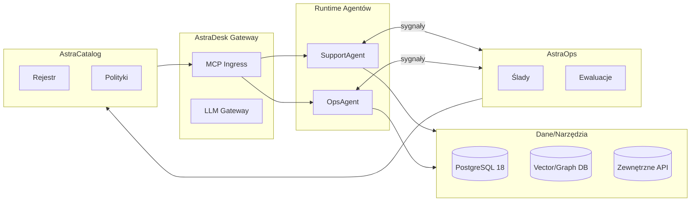

# 1. Wprowadzenie - Wizja AstraDesk

> AstraDesk Enterprise AI Framework v1.0 - Przewodnik Techniczny (PL)

**AstraDesk** to bezpieczny, modularny framework do budowania **korporacyjnych agentów AI**, które rozumują, planują i działają za pomocą narzędzi.
Operacjonalizuje *AgentOps* (obserwowalność + ewaluacja), *governance* oraz *DevSecOps* specjalnie dla systemów agentowych.

 

## Dlaczego AstraDesk teraz

- Od deterministycznego kodu → do pętli probabilistycznego rozumowania.

- Od statycznych przepływów pracy → do adaptacyjnych, celowych agentów.

- Od podejścia "kod najpierw" → do **"ewaluacja najpierw"** (wdrażaj z dowodami, nie intuicją).

 

## Co zawiera v1.0

- Runtime dla pojedynczego agenta (SupportAgent / OpsAgent) z funkcją human-in-the-loop.

- Integracje oparte na MCP (narzędzia/zasoby/prompty) przez **AstraDesk Gateway**.

- **AstraOps** do śledzenia, metryk, ewaluacji; **AstraCatalog** do zarządzania właścicielstwem, ryzykiem i wersjami.

- Wdrożenia hybrydowe: AWS/Kubernetes/OpenShift/on-prem; PostgreSQL 18; OpenTelemetry.

 

## Mapa dokumentacji

> - 2. Przegląd Architektury → ogólny obraz
>
> - 3. (3.-7.) ADLC → planowanie, budowanie, testowanie/optymalizacja, wdrażanie, operowanie
>
> - 8. Bezpieczeństwo i Governance
>
> - 9. MCP Gateway i Pakiety Domenowe
>
> - 10. Przyszła Mapa Drogowa i Słowniczek

 

 

## Szkic architektury wysokiego poziomu (kontekst)

 

 

**Dalej:** [2. Przegląd Architektury](02_architecture_overview.pl.md)