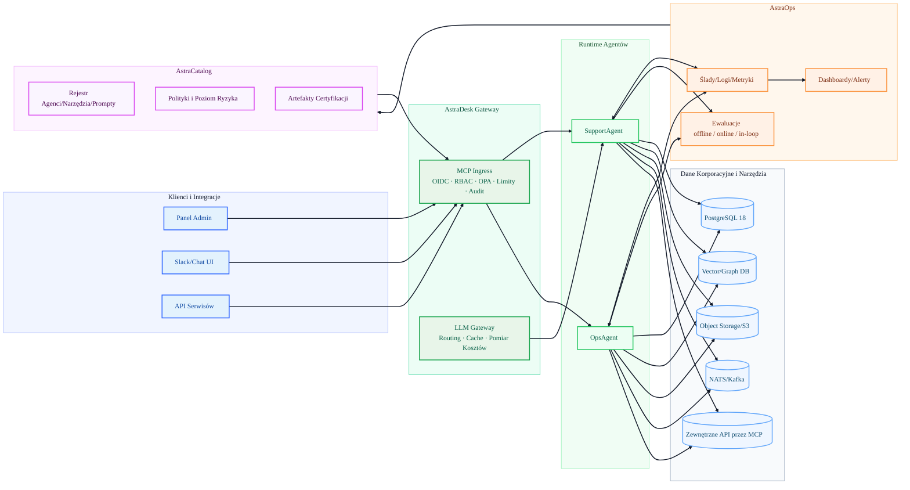
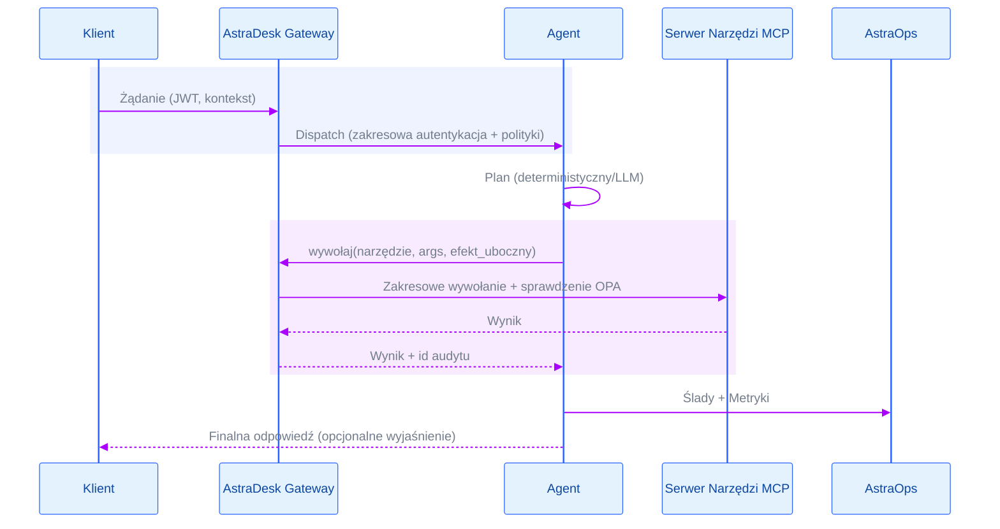
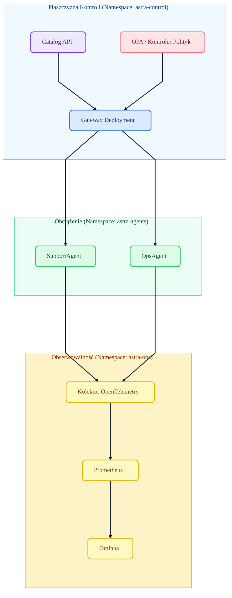

# 2. Przegląd Architektury

> AstraDesk rozdziela **kontrolę** (Gateway, Catalog, Policy) od **wykonania** (Agenci + Narzędzia) i **dowodów** (AstraOps).  
> Wersja: Framework 1.0 (skupienie na pojedynczym agencie z human-in-the-loop).

## 2.1 Cele i Nie-Cele (v1.0)

- **Cele**  
  - Bezpieczny, obserwowalny runtime pojedynczego agenta (SupportAgent/OpsAgent).  
  - Integracje **MCP-first** przez AstraDesk Gateway (authZ, OPA, limity częstotliwości, audit).  
  - Telemetria i ewaluacje przez **AstraOps** (ślady, metryki, ewaluacje offline/online).  
  - **AstraCatalog** dla własności, poziomu ryzyka, wersji, artefaktów certyfikacji.

- **Nie-Cele**  
  - Orkiestracja roju wielu agentów (planowane w v2.0).  
  - Automatyczna modyfikacja promptów w produkcji bez bramek zatwierdzających.  
  - Nieograniczone uprawnienia narzędzi (wszystkie narzędzia wymagają jawnego zakresu i klasy efektów ubocznych).

 

---

## 2.2 Diagram Systemu Wysokiego Poziomu

 

 

---

## 2.3 Odpowiedzialności Komponentów

 

### AstraDesk Gateway

- **Tożsamość i Dostęp**: OIDC/OAuth2 dla agentów i narzędzi; RBAC per narzędzie z allow-listami parametrów.

- **Wymuszanie Polityk**: zabezpieczenia OPA/Rego; routing środowiskowy (dev/stage/prod).

- **Limity Częstotliwości i Kwoty**: per tenant/agent/narzędzie; backpressure i circuit breakers.

- **Audit**: wszystkie wywołania narzędzi MCP podpisane z digestami żądań/odpowiedzi.

 

### Runtime Agentów (SupportAgent/OpsAgent)

- **Rozumowanie i Planowanie** (v1.0): deterministyczny planer + opcja LLM; jawne granice **akceptowalnej autonomii**.

- **Pamięć**: efemeryczna pamięć zadań z TTL; opcjonalne wyszukiwania vector/graph (domyślnie tylko odczyt).

- **Narzędzia**: narzędzia MCP z zadeklarowanymi efektami ubocznymi (`read|write|execute`) i schematami.

- **Human-in-the-loop**: punkty zatwierdzania dla akcji `write/execute`.

 

### AstraOps

- **Ślady** przepływów agentowych: prompt → plan → wywołania narzędzi → efekty uboczne → odpowiedź.

- **Metryki**: p95 opóźnienia, sukces narzędzi, proxy ugruntowania, koszt per zadanie.

- **Ewaluacje**: CI/offline, produkcja/online i bramki **in-loop** (np. trafność kontekstu).

 

### AstraCatalog

- **Rejestr**: agenci, narzędzia, prompty, datasety, trasy modeli.

- **Ryzyko i Polityki**: per wersja agenta; kontrole zmian; metadane kill-switch.

- **Certyfikacja**: artefakty dla wdrożenia (wyniki eval, notatki red-team, wskaźniki SBOM).

 

### Dane i Narzędzia

- **PostgreSQL 16→18**: system referencyjny (odczyt/zapis przez zarządzane narzędzia).

- **Vector/Graph DB**: wyszukiwanie i relacje; domyślnie tylko odczyt w v1.0.

- **Magistrale**: NATS/Kafka dla zdarzeń i zadań async; idempotentne handlery.

- **Zewnętrzne API**: tylko przez zarejestrowane serwery MCP z zakresowymi tokenami.

 

---

## 2.4 Sekwencja: Żądanie → Wynik (Happy Path)

 

 

 

---

## 2.5 Widoki Wdrożenia (Kubernetes/EKS)

 

 

---

## 2.6 Poziom Bezpieczeństwa (v1.0)

* **Najmniejsze Uprawnienia** dla każdego narzędzia MCP; jawna klasa efektów ubocznych wymuszana na bramce.

* **Izolacja Środowisk**: dev/stage/prod z oddzielnymi poświadczeniami i pakietami polityk.

* **Łańcuch Dostaw**: podpisane obrazy kontenerów; załączony SBOM; polityki admission blokują nieznane digesty.

* **Dane**: sekrety w managerze (KMS/ASM), filtry PII na wejściu, allow-listy na wyjściu.

 

---

## 2.7 Model Obserwowalności

* **Ślady**: span per krok planu i per wywołanie narzędzia; ID korelacji przez gateway/agent/narzędzie.

* **Metryki**: SLO (p95 opóźnienia), KPI biznesowe (containment, rozwiązanie), KPI bezpieczeństwa (naruszenia polityk).

* **Dashboardy**: widoki operatora i właściciela; playbooki triage → RCA; kontrola zmęczenia alertami.

 

---

## 2.8 Rozszerzalność i Punkty Zaczepienia Mapy Drogowej

* **Orkiestracja wielu agentów** przez router świadomy polityk (v2.0).

* **Pamięć AstraGraph** z czasowym zanikaniem i wyszukiwaniem świadomym relacji (v2.0).

* **Routing modeli świadomy kosztów** (p95 + limity cenowe) w LLM Gateway.

 

---

## 2.9 Odniesienia Krzyżowe

* Dalej: [3. Faza Planowania](03_plan_phase.pl.md)

* Wstecz: [1. Wprowadzenie](01_introduction.pl.md)

* Zobacz także: [8. Bezpieczeństwo i Governance](08_security_governance.pl.md), [7. Monitorowanie i Operowanie](07_monitor_operate.pl.md)

 