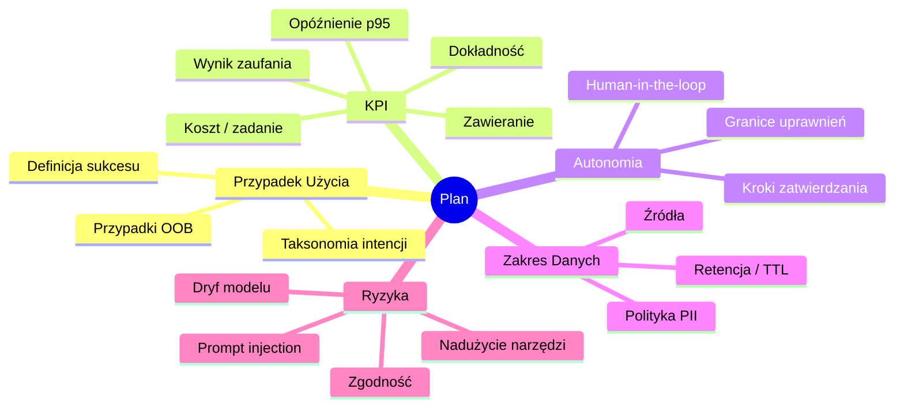

# 3. Faza Planowania - Przypadek Użycia, KPI, Akceptowalna Autonomia

> Planuj z myślą o **wynikach biznesowych** i **akceptowalnej autonomii**.  
> Rezultat tej fazy: Karta Przypadku Użycia, kontrakt KPI, zakres dostępu do danych i rejestr ryzyka.

<br>

<br>

---

## 3.1 Mapa Myśli Planowania

<br>



<br>

<br>

---

## 3.2 Karta Przypadku Użycia (szablon)

Użyj tej karty dla każdego agenta (v1.0 skupia się na **pojedynczym agencie**).

<br>

```yaml
# plik: charters/support_agent.yaml
id: support-agent
owner: support.platform@company.com
mission: >
  Rozwiązuj intencje wsparcia Tier-1 (autentykacja, hasło, dostęp) przez 
  wyszukiwanie w KB i twórz/kieruj zgłoszenia gdy potrzeba, z bezpiecznymi 
  zatwierdzeniami dla akcji zapisu.
kpis:
  accuracy_target: 0.85           # Poprawność ewaluacji offline
  latency_p95_seconds: 8
  cost_per_task_usd: 0.03
  containment_rate: 0.60          # % rozwiązanych bez przekazania człowiekowi
  trust_score_target: 0.80
acceptable_agency:
  max_side_effect: read            # domyślnie; eskaluj dla write/execute
  approvals:
    - action: jira.create_issue
      approver_group: support.leads
      sla_seconds: 120
data_scope:
  readonly:
    - postgres: service_db.public_kb
    - vector: kb_embeddings.v1
  pii_filters:
    - email
    - phone
    - password_tokens
  retention:
    short_term_memory_ttl_minutes: 60
risks:
  - name: prompt_injection
    mitigation: firewall promptów + allow-lista narzędzi
  - name: data_leakage
    mitigation: Czyszczenie PII na wejściu + polityka OPA
rollout:
  envs: [dev, stage, prod]
  gates:
    - offline_evals
    - security_scan
    - approval_check
```

<br>

---

## 3.3 Kontrakt KPI (czytelny maszynowo)

Mały, deklaratywny "kontrakt", który AstraOps może załadować do wymuszania SLO i alertowania.

<br>

```json
{
  "agent_id": "support-agent",
  "version": "1.0.0",
  "kpi_contract": {
    "accuracy_min": 0.85,
    "latency_p95_max_seconds": 8,
    "cost_per_task_max_usd": 0.03,
    "containment_min": 0.60,
    "trust_score_min": 0.80
  },
  "alerting": {
    "channels": ["slack://#agent-ops", "email://agent-owners@company.com"],
    "rules": [
      {"metric": "latency_p95", "op": ">", "value": 8, "for": "5m"},
      {"metric": "containment", "op": "<", "value": 0.6, "for": "30m"}
    ]
  }
}
```

<br>

---

## 3.4 Akceptowalna Autonomia i Zatwierdzenia

* **Domyślnie**: tylko efekty uboczne `read`.

* Każde `write/execute` wymaga zatwierdzenia (jawny zatwierdzający lub grupa), logowane do **AstraOps** i **AstraCatalog**.

<br>

**Przykład OPA (polityka jako kod):**

<br>

```rego
package astra.plan.agency

default allow = false

# odczyty dozwolone dla uwierzytelnionych agentów
allow {
  input.tool.side_effect == "read"
  input.auth.role != ""
}

# zapisy wymagają jawnego załącznika zatwierdzenia w kontekście
allow {
  input.tool.side_effect == "write"
  input.context.approval == true
  input.auth.role == "support.agent"
}
```

<br>

---

## 3.5 Zakres Dostępu do Danych (postawa odczyt-pierwsza)

* **PostgreSQL 18**: tylko schematy wymienione w karcie (`service_db.public_kb`).

* **Vector/Graph DB**: tylko wyszukiwanie (brak zapisów w v1.0).

* **Zewnętrzne API**: tylko przez zarejestrowane serwery **MCP** z zakresowymi tokenami.

* **Obsługa PII**: czyszczenie na wejściu + allow-listy na wyjściu.

<br>

**Konfiguracja czyszczenia na wejściu (przykład):**

<br>

```yaml
# plik: gateway/pii_scrub.yaml
filters:
  - type: email
  - type: phone
  - type: secrets
actions:
  on_detect: redact
  log_event: true
```

<br>

---

## 3.6 Rejestr Ryzyka (żywy dokument)

Śledź ryzyka z właścicielami i testami.

<br>

```yaml
# plik: risks/support_agent_risks.yaml
risks:
  - id: R1
    name: prompt_injection
    owner: sec.arch@company.com
    severity: high
    test:
      type: redteam_promptset
      path: tests/redteam/prompt_injection.jsonl
  - id: R2
    name: tool_misuse
    owner: agent.ops@company.com
    severity: medium
    test:
      type: simulation
      path: tests/simulations/tool_side_effects.yaml
```

<br>

---

## 3.7 Lista Kontrolna Planowania (zaznacz przed Budowaniem)

* [ ] Karta ukończona i zatwierdzona przez właściciela i bezpieczeństwo.

* [ ] Kontrakt KPI opublikowany w AstraOps.

* [ ] Akceptowalna autonomia udokumentowana; ścieżki zatwierdzania uzgodnione.

* [ ] Zakres danych zdefiniowany; filtry PII skonfigurowane.

* [ ] Ryzyka zarejestrowane z testami; właściciele przypisani.

* [ ] Środowiska wdrożeniowe i bramki (ewaluacje, bezpieczeństwo, zatwierdzenia) zdefiniowane.

<br>

---

## 3.8 Odniesienia Krzyżowe

* Dalej: [4. Faza Budowania](04_build_phase.pl.md)

* Wstecz: [2. Przegląd Architektury](02_architecture_overview.pl.md)

* Zobacz także: [8. Bezpieczeństwo i Governance](08_security_governance.pl.md)

<br>