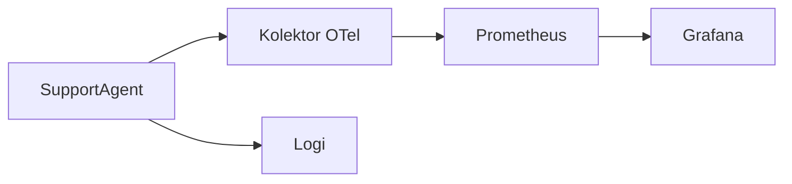

# 6. Faza Wdrożenia - CI/CD, Sandboxing, Progresywna Dostawa

> Cel: bezpiecznie wdrożyć SupportAgent do **Kubernetes (EKS/OpenShift/on-prem)** z silnymi domyślnymi ustawieniami:  
> non-root, read-only FS, NetworkPolicy, RBAC, SBOM+scan, polityki OPA i progresywne wdrożenie.

<br>

---

## 6.1 Obraz Kontenera (Dockerfile)

<br>

```dockerfile
# plik: docker/Dockerfile
FROM python:3.13-slim

ENV PYTHONDONTWRITEBYTECODE=1 \
    PYTHONUNBUFFERED=1 \
    PIP_NO_CACHE_DIR=1

# Zależności systemowe
RUN apt-get update && apt-get install -y --no-install-recommends \
      ca-certificates tini curl && \
    rm -rf /var/lib/apt/lists/*

WORKDIR /app
COPY requirements.txt .
RUN pip install --no-cache-dir -r requirements.txt

# Kopiuj źródła (read-only w runtime)
COPY agents/ agents/
COPY mcp/ mcp/
COPY telemetry/ telemetry/
COPY configs/ configs/
COPY run_support_agent.py .

# Utwórz użytkownika non-root
RUN useradd -u 10001 -m astradesk
USER 10001:10001

# Eksponuj port web (jeśli dodasz REST shim)
ENV PORT=8080
CMD ["/usr/bin/tini","--","python","run_support_agent.py"]
```

<br>

---

## 6.2 Terraform (fragment AWS EKS)

```hcl
# plik: infra/eks/main.tf
terraform {
  required_version = ">= 1.6.0"
  required_providers {
    aws = { source = "hashicorp/aws", version = "~> 5.0" }
  }
}

provider "aws" { region = var.region }

module "eks" {
  source         = "terraform-aws-modules/eks/aws"
  version        = "~> 20.0"
  cluster_name   = var.cluster_name
  cluster_version= "1.29"
  vpc_id         = var.vpc_id
  subnet_ids     = var.subnet_ids
  manage_aws_auth= true
}

output "cluster_name" { value = module.eks.cluster_name }
```

<br>

```hcl
# plik: infra/eks/variables.tf
variable "region" { type = string }
variable "cluster_name" { type = string }
variable "vpc_id" { type = string }
variable "subnet_ids" { type = list(string) }
```

<br>

---

## 6.3 Manifesty Kubernetes (bezpieczne domyślne)

<br>

### 6.3.1 Namespace i RBAC

```yaml
# plik: k8s/00-namespace-rbac.yaml
apiVersion: v1
kind: Namespace
metadata:
  name: astra-agents
---
apiVersion: rbac.authorization.k8s.io/v1
kind: Role
metadata:
  name: support-agent-readonly
  namespace: astra-agents
rules:
  - apiGroups: [""]           # core
    resources: ["configmaps","secrets"]
    verbs: ["get","list","watch"]
---
apiVersion: rbac.authorization.k8s.io/v1
kind: RoleBinding
metadata:
  name: support-agent-readonly-binding
  namespace: astra-agents
subjects:
  - kind: ServiceAccount
    name: support-agent
    namespace: astra-agents
roleRef:
  kind: Role
  name: support-agent-readonly
  apiGroup: rbac.authorization.k8s.io
```

<br>

### 6.3.2 Deployment + Service

```yaml
# plik: k8s/10-deployment.yaml
apiVersion: v1
kind: ServiceAccount
metadata:
  name: support-agent
  namespace: astra-agents
---
apiVersion: apps/v1
kind: Deployment
metadata:
  name: support-agent
  namespace: astra-agents
  labels: { app: support-agent }
spec:
  replicas: 2
  revisionHistoryLimit: 5
  selector:
    matchLabels: { app: support-agent }
  template:
    metadata:
      labels: { app: support-agent }
    spec:
      serviceAccountName: support-agent
      securityContext:
        runAsNonRoot: true
        seccompProfile: { type: RuntimeDefault }
      containers:
        - name: app
          image: ghcr.io/org/astradesk/support-agent:1.0.0
          imagePullPolicy: IfNotPresent
          ports:
            - containerPort: 8080
          env:
            - name: ASTRA_ENV
              valueFrom: { secretKeyRef: { name: support-agent-secrets, key: env } }
          resources:
            requests: { cpu: "250m", memory: "256Mi" }
            limits:   { cpu: "1",    memory: "512Mi" }
          securityContext:
            allowPrivilegeEscalation: false
            readOnlyRootFilesystem: true
            capabilities: { drop: ["ALL"] }
          readinessProbe:
            httpGet: { path: /ready, port: 8080 }
            periodSeconds: 5
          livenessProbe:
            httpGet: { path: /health, port: 8080 }
            periodSeconds: 10
          volumeMounts:
            - name: tmp
              mountPath: /tmp
      volumes:
        - name: tmp
          emptyDir: { medium: Memory }
---
apiVersion: v1
kind: Service
metadata:
  name: support-agent
  namespace: astra-agents
spec:
  selector: { app: support-agent }
  ports:
    - name: http
      port: 80
      targetPort: 8080
```

<br>

### 6.3.3 NetworkPolicy (domyślne deny-all + zezwolenie na ingress)

```yaml
# plik: k8s/20-networkpolicy.yaml
apiVersion: networking.k8s.io/v1
kind: NetworkPolicy
metadata:
  name: default-deny
  namespace: astra-agents
spec:
  podSelector: {}
  policyTypes: ["Ingress","Egress"]
  ingress: []
  egress: []
---
apiVersion: networking.k8s.io/v1
kind: NetworkPolicy
metadata:
  name: allow-gateway-to-agent
  namespace: astra-agents
spec:
  podSelector:
    matchLabels: { app: support-agent }
  policyTypes: ["Ingress"]
  ingress:
    - from:
        - namespaceSelector:
            matchLabels: { name: astra-control }   # gdzie działa Gateway
      ports:
        - protocol: TCP
          port: 8080
```

<br>

---

## 6.4 Bezpieczeństwo Pod i Admission (baseline)

```yaml
# plik: k8s/30-podsecurity.yaml
apiVersion: policy/v1beta1
kind: PodSecurityPolicy
metadata:
  name: restricted-legacy
  annotations:
    seccomp.security.alpha.kubernetes.io/allowedProfileNames: 'runtime/default'
spec:
  privileged: false
  readOnlyRootFilesystem: true
  runAsUser:
    rule: MustRunAsNonRoot
  seLinux:
    rule: RunAsAny

```

> Na nowoczesnych klastrach używaj **Pod Security Standards (PSS)** / etykiet namespace lub równoważnego **OpenShift SCC**.

<br>

---

## 6.5 Progresywna Dostawa (Canary lub Blue/Green)

<br>

```yaml
# plik: k8s/40-rollout-kubernetes.yaml
apiVersion: apps/v1
kind: Deployment
metadata:
  name: support-agent
  namespace: astra-agents
spec:
  strategy:
    type: RollingUpdate
    rollingUpdate:
      maxSurge: 1
      maxUnavailable: 0
```

<br>

Lub z **Argo Rollouts** (przykład canary):

```yaml
# plik: k8s/40-rollout-argo.yaml
apiVersion: argoproj.io/v1alpha1
kind: Rollout
metadata:
  name: support-agent
  namespace: astra-agents
spec:
  replicas: 2
  selector:
    matchLabels: { app: support-agent }
  template:
    metadata:
      labels: { app: support-agent }
    spec:
      containers:
        - name: app
          image: ghcr.io/org/astradesk/support-agent:1.0.1
          ports: [{ containerPort: 8080 }]
  strategy:
    canary:
      steps:
        - setWeight: 20
        - pause: { duration: 120 }
        - setWeight: 50
        - pause: { duration: 300 }
        - setWeight: 100
```

<br>

---

## 6.6 CI/CD - Jenkinsfile

```groovy
// plik: ci/Jenkinsfile
pipeline {
  agent any
  environment {
    REG = "ghcr.io/org/astradesk"
    IMG = "support-agent"
    TAG = "1.0.${BUILD_NUMBER}"
  }
  stages {
    stage('Checkout'){ steps { checkout scm } }
    stage('CI'){
      steps {
        sh 'python -V'
        sh 'pip install -r requirements.txt'
        sh 'pytest -q'
      }
    }
    stage('Build'){
      steps { sh 'docker build -f docker/Dockerfile -t $REG/$IMG:$TAG .' }
    }
    stage('SBOM & Scan'){
      steps {
        sh 'syft $REG/$IMG:$TAG -o json > sbom.json || true'
        sh 'trivy image --exit-code 1 $REG/$IMG:$TAG || true'
      }
    }
    stage('Push'){ steps { sh 'docker push $REG/$IMG:$TAG' } }
    stage('Deploy'){
      steps {
        withKubeConfig([credentialsId: 'kubeconfig-eks']) {
          sh 'kubectl -n astra-agents apply -f k8s/10-deployment.yaml'
          sh 'kubectl -n astra-agents apply -f k8s/20-networkpolicy.yaml'
        }
      }
    }
  }
}
```

<br>

---

## 6.7 CI/CD - GitHub Actions (alternatywa)

```yaml
# plik: .github/workflows/ci.yml
name: astra-ci
on:
  push: { branches: [main] }
  pull_request:
jobs:
  build-test-deploy:
    runs-on: ubuntu-latest
    permissions:
      contents: read
      packages: write
      id-token: write
    steps:
      - uses: actions/checkout@v4
      - uses: actions/setup-python@v5
        with: { python-version: '3.13' }
      - name: Instalacja
        run: pip install -r requirements.txt
      - name: Testy
        run: pytest -q
      - name: Budowa
        run: docker build -f docker/Dockerfile -t ghcr.io/org/astradesk/support-agent:${{ github.sha }} .
      - name: Login GHCR
        uses: docker/login-action@v3
        with:
          registry: ghcr.io
          username: ${{ github.actor }}
          password: ${{ secrets.GITHUB_TOKEN }}
      - name: Push
        run: docker push ghcr.io/org/astradesk/support-agent:${{ github.sha }}
      - name: Kubeconfig (OIDC do AWS)
        uses: aws-actions/configure-aws-credentials@v4
        with:
          role-to-assume: ${{ secrets.AWS_ROLE_ARN }}
          aws-region: eu-central-1
      - name: Wdrożenie
        run: |
          aws eks update-kubeconfig --name ${{ secrets.EKS_CLUSTER }}
          kubectl -n astra-agents apply -f k8s/10-deployment.yaml
          kubectl -n astra-agents apply -f k8s/20-networkpolicy.yaml
```

<br>

---

## 6.8 OPA/Gatekeeper (bramka polityki)

```yaml
# plik: policies/deny-privileged.yaml
apiVersion: constraints.gatekeeper.sh/v1beta1
kind: K8sPSPPrivilegedContainer
metadata:
  name: disallow-privileged
spec:
  match:
    kinds:
      - apiGroups: [""]
        kinds: ["Pod"]
```

<br>

---

## 6.9 Okablowanie Obserwowalności

* **OpenTelemetry**: ustaw `OTEL_EXPORTER_OTLP_ENDPOINT`, eksportuj spany dla `plan`, `tool_call`, `compose`.

* **Prometheus**: eksponuj `/metrics` przez bibliotekę kliencką jeśli dodasz HTTP shim.

* **Dashboardy Grafana**: panel SLO (p95 opóźnienia), sukces narzędzi, koszt/zadanie.

<br>



<br>

<br>

---

## 6.10 Lista Kontrolna Wydania (v1.0)

* [ ] Kontenery są **non-root**, read-only FS, `seccomp=RuntimeDefault`.

* [ ] **NetworkPolicy** domyślnie deny-all; jawne zezwolenie od Gateway.

* [ ] **RBAC** minimalne; ServiceAccount związane z Role tylko do odczytu.

* [ ] **SBOM** wygenerowane i obraz przeskanowany; nieznane digesty zablokowane.

* [ ] **OPA/Gatekeeper** ograniczenia aktywne; logi admission monitorowane.

* [ ] Plan canary/rollout zdefiniowany; rollback przetestowany.

* [ ] Dashboardy i alerty skonfigurowane; kontrakt KPI załadowany w AstraOps.

<br>

---

## 6.11 Odniesienia Krzyżowe

* Dalej: [7. Monitorowanie i Operowanie](07_monitor_operate.pl.md)

* Wstecz: [5. Testowanie i Optymalizacja](05_test_optimize.pl.md)

* Zobacz także: [8. Bezpieczeństwo i Governance](08_security_governance.pl.md)

<br>