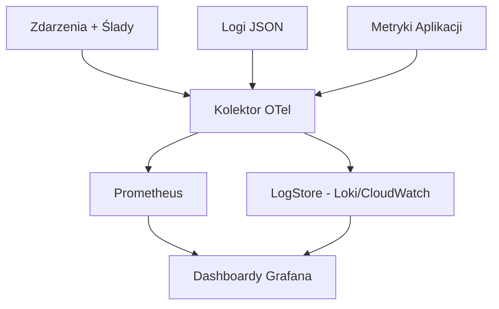

# 7. Monitorowanie i Operowanie - AstraOps, SLO, RCA

> Operacje dla systemów agentowych muszą odpowiadać na dwa pytania:
> 1) **Czy działa?** (zdrowie infrastruktury)  
> 2) **Czy jest poprawny?** (jakość/bezpieczeństwo/koszt).
>
> Ten rozdział okablowuje **AstraOps**: telemetrię (MELT), SLO, alertowanie, runbooki i RCA.

<br>

---

## 7.1 Model Obserwowalności (MELT)

- **Metryki**: p95 opóźnienia, sukces wywołań narzędzi, koszt tokenów/zadanie, głębokość kolejki.

- **Zdarzenia/Ślady**: plan → wywołania narzędzi → zatwierdzenia → komponowanie → odpowiedź.

- **Logi**: ustrukturyzowany JSON, ID korelacji (gateway↔agent↔narzędzie).

- **ID Telemetrii**: `x-astradesk-trace-id`, `x-astradesk-tool-span-id`.

<br>



<br>

<br>

---

## 7.2 SLO i Kontrakt KPI (AstraOps)

<br>

### 7.2.1 SLO (domyślne dla SupportAgent)

| SLO              |    Cel | Okno | Uwaga                    |
| ---------------- | -----: | ---: | ------------------------ |
| **Opóźnienie p95**  |  ≤ 8s |   7d | koniec-do-końca          |
| **Sukces narzędzi** | ≥ 95% |   7d | schemat-valid + 2xx      |
| **Zawieranie**      | ≥ 60% |  30d | bez przekazania człowiek |
| **Ugruntowanie**    | ≥ 0.80|   7d | judge/heurystyka         |
| **Koszt / zadanie** |≤$0.03 |   7d | tokeny + narzędzia       |

<br>

### 7.2.2 Loader Kontraktu KPI (przykład)

```python
# plik: ops/kpi_loader.py
import json, os
from pathlib import Path

def load_kpi_contract(path="configs/kpi.support.json"):
    contract = json.loads(Path(path).read_text(encoding="utf-8"))
    # publikuj do metryk lub tematu konfiguracyjnego dla dashboardów
    print("[ops] załadowano kontrakt KPI:", contract["kpi_contract"])
    return contract
```

<br>

---

## 7.3 Okablowanie Telemetrii (OpenTelemetry)

<br>

### 7.3.1 Kolektor (OTLP → Prometheus / Loki)

```yaml
# plik: ops/otel-collector.yaml
receivers:
  otlp:
    protocols:
      http:
      grpc:

processors:
  batch:
  attributes:
    actions:
      - key: service.name
        action: upsert
        value: "astradesk-support-agent"

exporters:
  prometheus:
    endpoint: "0.0.0.0:9464"
  loki:
    endpoint: http://loki:3100/loki/api/v1/push
  debug:

service:
  pipelines:
    traces:
      receivers: [otlp]
      processors: [batch, attributes]
      exporters: [debug]
    metrics:
      receivers: [otlp]
      processors: [batch, attributes]
      exporters: [prometheus]
    logs:
      receivers: [otlp]
      processors: [batch, attributes]
      exporters: [loki]
```

<br>

### 7.3.2 Emisja Metryk Agenta (Python)

```python
# plik: telemetry/metrics.py
from typing import Dict
from time import time
import random

class Metrics:
    def __init__(self, emit=lambda m,v,**kw: print("[metric]", m, v, kw)):
        self.emit = emit

    def observe_latency(self, ms: float, label: str = "end_to_end"):
        self.emit("astradesk_latency_ms", ms, label=label)

    def observe_cost(self, usd: float):
        self.emit("astradesk_cost_usd", usd)

    def tool_success(self, name: str, ok: bool):
        self.emit("astradesk_tool_success", 1 if ok else 0, tool=name)

metrics = Metrics()
```

<br>

---

## 7.4 Dashboardy (Grafana)

<br>

### 7.4.1 Dashboard Startowy (fragment JSON)

```json
{
  "title": "AstraDesk - SLO SupportAgent",
  "panels": [
    { "type": "graph", "title": "Opóźnienie p95 (s)",
      "targets": [{ "expr": "histogram_quantile(0.95, sum(rate(http_request_duration_seconds_bucket{job=\"astradesk\"}[5m])) by (le))" }]
    },
    { "type": "stat", "title": "Sukces Narzędzi (%)",
      "targets": [{ "expr": "100*avg_over_time(astradesk_tool_success[1h])" }]
    },
    { "type": "stat", "title": "Koszt per zadanie ($)",
      "targets": [{ "expr": "avg_over_time(astradesk_cost_usd[1h])" }]
    }
  ],
  "schemaVersion": 39
}
```

<br>

---

## 7.5 Alertowanie (Prometheus Alertmanager)

<br>

### 7.5.1 Reguły Alertów

```yaml
# plik: ops/alerts.rules.yaml
groups:
- name: astra-slos
  rules:
  - alert: AstraLatencyP95High
    expr: histogram_quantile(0.95, sum(rate(http_request_duration_seconds_bucket{job="astradesk"}[5m])) by (le)) > 8
    for: 10m
    labels: { severity: page }
    annotations:
      summary: "Opóźnienie p95 > 8s"
      description: "Zbadaj opóźnienie model/gateway/narzędzie. Trace ID w logach."
  - alert: AstraToolSuccessDrop
    expr: avg_over_time(astradesk_tool_success[30m]) < 0.95
    for: 15m
    labels: { severity: page }
    annotations:
      summary: "Sukces narzędzi < 95%"
      description: "Zmiany schematu? Awaria MCP? Sprawdź audit Gateway."
  - alert: AstraCostPerTaskSpike
    expr: avg_over_time(astradesk_cost_usd[30m]) > 0.03
    for: 30m
    labels: { severity: warn }
    annotations:
      summary: "Koszt per zadanie powyżej celu"
      description: "Przejrzyj routing/cache i długość promptu."
```

<br>

### 7.5.2 Trasy Alertmanager

```yaml
# plik: ops/alertmanager.yaml
route:
  receiver: "ops-team"
  group_by: ["alertname"]
  routes:
    - matchers: [ severity = "page" ]
      receiver: "oncall-pager"
receivers:
  - name: "ops-team"
    slack_configs:
      - channel: "#agent-ops"
        send_resolved: true
  - name: "oncall-pager"
    pagerduty_configs:
      - routing_key: "${PAGERDUTY_KEY}"
```

<br>

---

## 7.6 Runbooki (gotowe na RCA)

<br>

### 7.6.1 Podwyższone Opóźnienie

1. **Triage**: Panel Grafana → próbkowanie spanów w OTel → identyfikacja wąskiego gardła (Gateway vs Narzędzie vs Model).

2. **Mitygacja**:

   * Włącz cache'owanie odpowiedzi w Gateway.

   * Obniż `top_k` dla wyszukiwania; zmniejsz kontekst promptu.

   * Przekieruj planer do tańszego/szybszego poziomu modelu.

3. **Działania następcze**: otwórz incydent w **AstraCatalog**; dodaj canary eval by złapać regresję.

<br>

### 7.6.2 Spadek Sukcesu Narzędzi

1. Sprawdź audit Gateway dla nazw/argumentów zawodzących narzędzi.

2. Porównaj **schematy** narzędzi (Catalog) vs wywołanie agenta; rollback narzędzia/serwera jeśli niezgodność.

3. Jeśli awaria dostawcy → przełącz na awaryjne MCP lub degraduj gracefully.

<br>

### 7.6.3 Skok Kosztów

1. Zbadaj logi tokenów (LLM Gateway) - rozdęcie promptu lub nieoczekiwane powtórzenia.

2. Włącz cache'owanie tokenów; dodaj strażnika skracania.

3. Przekieruj ruch long-tail do wydajnego modelu.

<br>

---

## 7.7 Reagowanie na Incydenty i RCA

```yaml
# plik: ops/rca_template.yaml
incident:
  id: "INC-YYYYMMDD-001"
  summary: "Opóźnienie p95 przekroczyło 8s przez 30m"
  severity: "SEV-2"
  owner: "agent.ops@company.com"
  timeline:
    - "T0: Alert wywołany"
    - "T+5m: Zidentyfikowano timeouty narzędzi"
    - "T+12m: Przełączono na awaryjne MCP"
    - "T+30m: Opóźnienie znormalizowane"
  contributing_factors:
    - "Częściowa awaria dostawcy X"
    - "Brak cache'owania na narzędziu Y"
  corrective_actions:
    - "Włącz cache'owanie"
    - "Dodaj syntetyczną sondę"
    - "Zaktualizuj dashboard SLO"
```

<br>

---

## 7.8 Jakość w Produkcji (Ewaluacje In-loop)

Dodaj **mikro-bramki** które działają wewnątrz przepływów (tanie, deterministyczne).

```python
# plik: agents/guards.py
def context_relevance_guard(retrieved_titles, user_input: str) -> bool:
    """Blokuj krok komponowania jeśli wyszukiwanie jest nietrafne."""
    low = user_input.lower()
    return any(t.lower().split()[0] in low for t in retrieved_titles[:3])

def approval_guard(side_effect: str, approved: bool) -> bool:
    return side_effect == "read" or approved is True
```

<br>

Okabluj w agencie przed komponowaniem:

```python
# pseudo
if not context_relevance_guard([m["title"] for m in matches], user_input):
    raise RuntimeError("Sprawdzenie trafności kontekstu nieudane; poproś o wyjaśnienie")
```

<br>

---

## 7.9 Lekka Detekcja Anomalii (Koszt/Opóźnienie)

```python
# plik: ops/anomaly.py
from collections import deque
def ewma_anomaly(stream, alpha=0.2, k=3.0):
    """
    Zwraca iterator (wartość, czy_outlier) używając EWMA + pasmo k-sigma.
    O(1) per punkt; idealny dla strumieni telemetrii agentów.
    """
    mean, var = None, 0.0
    for x in stream:
        if mean is None:
            mean = x
            yield x, False
            continue
        prev = mean
        mean = alpha*x + (1-alpha)*mean
        var = alpha*(x - prev)**2 + (1-alpha)*var
        outlier = abs(x - mean) > k*(var**0.5 + 1e-6)
        yield x, outlier
```

<br>

---

## 7.10 Lista Kontrolna Operacji

* [ ] Kolektor OTel wdrożony; spany/metryki/logi płyną.

* [ ] Dashboard Grafana zaimportowany; panele SLO zielone.

* [ ] Reguły Prometheus + trasy Alertmanager aktywne (test fire).

* [ ] Runbooki przechowywane w repo + zlinkowane w dashboardach.

* [ ] Kontrakt KPI załadowany; alerty odzwierciedlają cele.

* [ ] Syntetyczne sondy dla krytycznych narzędzi (MCP) na miejscu.

<br>

---

## 7.11 Odniesienia Krzyżowe

* Dalej: [8. Bezpieczeństwo i Governance](08_security_governance.pl.md)

* Wstecz: [6. Faza Wdrożenia](06_deploy_phase.pl.md)

* Zobacz także: [5. Testowanie i Optymalizacja](05_test_optimize.pl.md)

<br>
