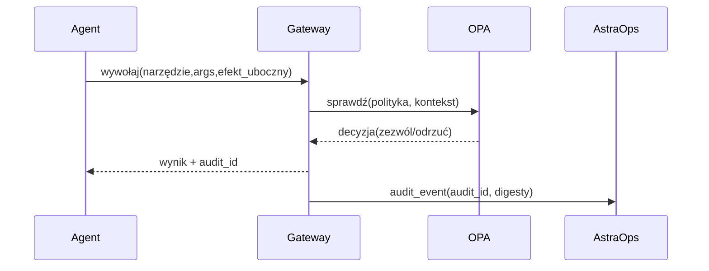
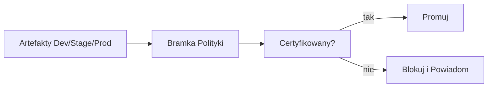

# 8. Bezpieczeństwo i Governance - RBAC, OPA, SBOM, Catalog

> Bezpieczeństwo jest **wbudowane**, nie dodawane później.  
> Ten rozdział definiuje **płaszczyznę kontroli**: tożsamość, autoryzację, politykę jako kod, ochronę danych, łańcuch dostaw i audit.

<br>

---

## 8.1 Zasady (v1.0)

- **Najmniejsze uprawnienia per narzędzie i parametr** (efekty uboczne: `read|write|execute`).

- **Jawne zatwierdzenia** dla `write/execute` z human-in-the-loop.

- **Polityka jako kod** (OPA/Rego) w **Gateway** + **admission Kubernetes**.

- **Separacja obowiązków**: Gateway vs Agenci vs serwery MCP.

- **Evidence-first**: wszystkie decyzje/audyty do **AstraOps** i **AstraCatalog**.

<br>

<br>

---

## 8.2 Tożsamość i Dostęp

<br>

### 8.2.1 Tożsamości

- **Agenci**: poświadczenia klienta OIDC (`client_id`, `client_secret` / workload identity).

- **Narzędzia MCP**: service principals z **zakresowymi tokenami** (per środowisko).

- **Ludzie**: SSO (OIDC/SAML) mapowane na role RBAC.

<br>

### 8.2.2 Role (przykłady)

| Rola              | Cel                                    | Uprawnienia Narzędzi       |
|-------------------|----------------------------------------|----------------------------|
| `support.agent`   | Bot wsparcia Tier-1                    | `kb.search:read`, `jira.create_issue:write (zatwierdzenie)` |
| `ops.agent`       | Triage obserwowalności                 | `metrics.read:read`, `remediation.seq:execute (zatwierdzenie)` |
| `catalog.owner`   | Utrzymanie rejestru                    | Publikuj/zatwierdź artefakty  |
| `sec.arch`        | Właściciel polityki bezpieczeństwa     | Zarządzaj pakietami OPA    |

<br>

---

## 8.3 Polityka jako Kod (OPA/Rego)

<br>

### 8.3.1 Bramka Efektów Ubocznych Narzędzi (Gateway)

```rego
# plik: policies/agent_tools.rego
package astra.gateway

default allow = false

# Zezwalaj na odczyty dla uwierzytelnionych agentów
allow {
  input.tool.side_effect == "read"
  input.auth.actor_type == "agent"
  input.auth.role != ""
}

# Zapisy wymagają jawnej roli + flagi zatwierdzenia w kontekście
allow {
  input.tool.side_effect == "write"
  input.auth.role == "support.agent"
  input.context.approval == true
}

# Execute wymaga roli ops i flagi emergency
allow {
  input.tool.side_effect == "execute"
  input.auth.role == "ops.agent"
  input.context.change_record != ""    # id incydentu/zmiany
}

# Blokuj zewnętrzne narzędzia gdy obecne PII
deny[msg] {
  input.context.contains_pii == true
  startswith(input.tool.name, "external.")
  msg := "Narzędzie zewnętrzne zablokowane dla PII"
}
```

<br>

### 8.3.2 Klasyfikacja Danych i Egress

```rego
# plik: policies/data_egress.rego
package astra.egress

default permit = false
level := input.context.classification  # public|internal|confidential

permit {
  level == "public"
  input.destination in {"webhook.trustedA","webhook.trustedB"}
}

permit {
  level == "internal"
  input.destination == "slack.corp"
  not input.payload.contains_secrets
}

# domyślnie odrzuć wszystko inne
```

> Pakuj polityki OPA i dystrybuuj przez Gateway; wersjonuj polityki w **AstraCatalog**.

<br>

---

## 8.4 Admission Kubernetes (Gatekeeper/PSA)

<br>

### 8.4.1 Odrzuć Uprzywilejowane i Wymuś Read-Only RootFS

```yaml
# plik: policies/gatekeeper/deny-privileged.yaml
apiVersion: constraints.gatekeeper.sh/v1beta1
kind: K8sPSPPrivilegedContainer
metadata: { name: disallow-privileged }
spec:
  match:
    kinds:
      - apiGroups: [""]
        kinds: ["Pod"]
```

```yaml
# plik: policies/gatekeeper/readonly-rootfs.yaml
apiVersion: constraints.gatekeeper.sh/v1beta1
kind: K8sPSPReadOnlyRootFilesystem
metadata: { name: enforce-readonly-rootfs }
spec:
  match:
    namespaces: ["astra-agents"]
```

> Na nowoczesnych klastrach preferuj etykiety namespace **Pod Security Admission (restricted)** lub równoważniki **OpenShift SCC**.

<br>

---

## 8.5 Łańcuch Dostaw: SBOM, Podpisywanie, Pochodzenie

<br>

### 8.5.1 SBOM i Skanowanie Obrazu (CI)

```bash
# Wygeneruj SBOM (Syft) i skanuj (Trivy)
syft ghcr.io/org/astradesk/support-agent:${GIT_SHA} -o spdx-json > sbom.spdx.json
trivy image --exit-code 1 ghcr.io/org/astradesk/support-agent:${GIT_SHA} || true
```

<br>

### 8.5.2 Podpisz i Zweryfikuj (cosign)

```bash
# Podpisz
cosign sign --key $COSIGN_KEY ghcr.io/org/astradesk/support-agent:${GIT_SHA}

# Zweryfikuj w kontrolerze admission lub zadaniu deploy
cosign verify --key $COSIGN_PUB ghcr.io/org/astradesk/support-agent:${GIT_SHA}
```

<br>

### 8.5.3 Certyfikacja Catalog

- Prześlij SBOM, raporty skanowania, pakiet cosign do **AstraCatalog**.

- Bramkuj wdrożenie na **Catalog Certified = true**.

<br>

---

## 8.6 Sekrety i Szyfrowanie

- **Secrets Manager** (AWS Secrets Manager/KMS; OpenShift: sealed-secrets).

- **Nigdy** nie wbudowuj poświadczeń w obrazy lub ConfigMaps.

- **W tranzycie**: mTLS Gateway↔Agent↔MCP; rotuj certyfikaty.

- **W spoczynku**: wolumeny/buckety szyfrowane KMS; klucze per środowisko.

- **Zakres tokenu**: wąski, krótkotrwały; sprawdzanie audience i TTL w Gateway.

<br>

---

## 8.7 Ochrona Danych i PII

<br>

### 8.7.1 Czyszczenie Ingress (Gateway)

```yaml
# plik: gateway/pii_scrub.yaml
filters:
  - type: email
  - type: phone
  - type: secrets
actions:
  on_detect: redact
  log_event: true
```

<br>

### 8.7.2 Allow-Lista Egress

```yaml
# plik: gateway/egress.yaml
allowed_destinations:
  - slack.corp
  - webhook.trustedA
block_patterns:
  - "http://*"
  - "https://unknown.*"
```

<br>

---

## 8.8 Audytowanie i Forensics

- **Zdarzenie audytu per wywołanie narzędzia**: nazwa narzędzia, hash schematu args, efekt uboczny, hash wyniku, id zatwierdzenia.

- **Korelacja śladu**: `x-astradesk-trace-id`, `x-gateway-audit-id`.

- **Retencja**: ≥ 90d dla prod; ≥ 1r dla krytycznych zatwierdzeń (per zgodność).

- **Zabezpieczenie przed zmianą**: przechowuj hashe w niezmiennym logu lub append-only object storage.

<br>



<br>

<br>

---

## 8.9 Governance w AstraCatalog

- **Rejestr**: agenci, narzędzia, prompty, datasety, polityki (z właścicielami).

- **Poziom Ryzyka**: per wersja agenta (klasy danych, uprawnienia narzędzi, zatwierdzenia).

- **Artefakty Wydania**: wyniki eval, notatki red-team, SBOM, podpisy.

- **Kill Switch**: per agent → natychmiastowe wyłączenie w Gateway.

<br>



<br>

<br>

---

## 8.10 Model Zagrożeń (szybki)

<br>

| Zagrożenie                 | Kontrola                                                        |       |                       |
| -------------------------- | --------------------------------------------------------------- | ----- | --------------------- |
| **Prompt injection**       | Firewall promptów + allow-lista narzędzi OPA + strażnik trafności kontekstu |       |                       |
| **Nadużycie narzędzi**     | Bramkowanie efektów ubocznych (`read                           | write | execute`) + zatwierdzenia |
| **Wyciek PII**             | Czyszczenie ingress, allow-lista egress, odrzuć zewnętrzne narzędzia z PII  |       |                       |
| **Ekspozycja poświadczeń** | Secrets manager + krótkotrwałe tokeny + brak dumpów env        |       |                       |
| **Manipulacja obrazem**    | SBOM + scan + weryfikacja cosign w admission                   |       |                       |
| **Obejście polityki**      | Scentralizowany Gateway; odrzuć bezpośredni dostęp do narzędzi; niezmienny audit |       |                       |

<br>

---

## 8.11 Minimalne Mapowanie Zgodności

- **ISO 27001**: A.9 (Dostęp), A.12 (Ops), A.14 (SDLC), A.18 (Zgodność).

- **SOC 2**: Kryteria zaufania Security, Availability, Confidentiality.

- **GDPR**: Minimalizacja danych, ograniczenie celu, logowanie dostępu, retencja.

<br>

---

## 8.12 Listy Kontrolne Operacyjne

- [ ] Pakiety OPA załadowane i wersjonowane; domyślne odrzucenie dla nieznanych narzędzi.

- [ ] Gatekeeper/PSA **restricted** wymuszony w namespace'ach.

- [ ] Obrazy podpisane i zweryfikowane; SBOM przechowywany w Catalog.

- [ ] Sekrety pobierane w runtime przez manager; rotacje przetestowane.

- [ ] Czyszczenie PII + allow-lista egress aktywne; testy syntetyczne zdają.

- [ ] Ścieżka audytu przeszukiwalna po `trace_id` i `audit_id`.

<br>

---

## 8.13 Odniesienia Krzyżowe

- Dalej: [9. MCP Gateway i Pakiety Domenowe](09_mcp_gateway_domain_packs.pl.md)

- Wstecz: [7. Monitorowanie i Operowanie](07_monitor_operate.pl.md)

- Zobacz także: [3. Faza Planowania](03_plan_phase.pl.md) - akceptowalna autonomia i zakres danych

<br>
