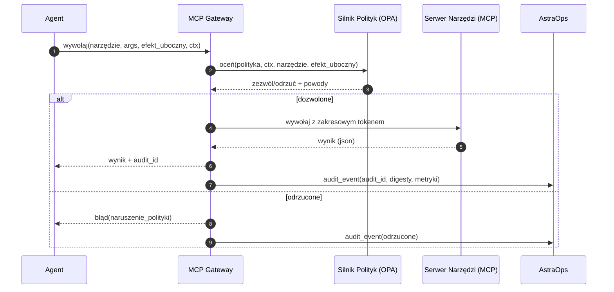
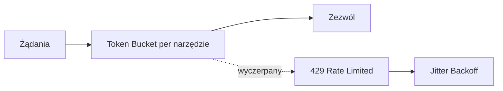

# 9. MCP Gateway i Pakiety Domenowe

> AstraDesk traktuje **wszystkie integracje** jako **serwery MCP** z zarządzanymi narzędziami/zasobami/promptami.  
> **Gateway** centralizuje authZ, polityki, kwoty, routing i audit. **Pakiety Domenowe** pakują gotowe do użycia narzędzia.

<br>

---

## 9.1 Odpowiedzialności Gateway (v1.0)

- **AuthN/Z**: OIDC dla agentów; **RBAC** per narzędzie z allow-listami parametrów.  

- **Polityka**: bramki efektów ubocznych OPA/Rego (`read|write|execute`), reguły egress świadome PII.  

- **Routing**: routing środowiskowy (dev/stage/prod), failover do awaryjnego MCP.  

- **Kwoty i Limity Częstotliwości**: per tenant/agent/narzędzie; circuit breakers.  

- **Rejestr Schematów**: JSON Schemas dla każdej wersji narzędzia; przypięty hash w czasie wywołania.  

- **Audit**: podpisane zdarzenie dla każdego wywołania narzędzia (digest args + digest wyniku).  

<br>



<br>

<br>

---

## 9.2 Konfiguracja Gateway (YAML, przykład)

```yaml
# plik: gateway/config.yaml
env: "prod"
oidc:
  issuer: "https://auth.company.com"
  audience: "astradesk-gateway"
rate_limits:
  default_rpm: 600
  per_tool:
    kb.search: 2400
    jira.create_issue: 120
policies:
  bundle_url: "s3://astracatalog/policies/bundle.tar.gz"
  deny_on_error: true
tools:
  - name: kb.search
    mcp: "https://mcp.kb.internal"
    side_effect: "read"
    schema_ref: "sha256:8a1c…"
  - name: jira.create_issue
    mcp: "https://mcp.jira.internal"
    side_effect: "write"
    schema_ref: "sha256:f3b0…"
fallbacks:
  kb.search: ["https://mcp.kb.backup"]
audit:
  sink: "kafka://astrabus/audit"
  hash_algo: "sha256"
  retention_days: 365
```

<br>

---

## 9.3 Zdarzenie Audytu (kanoniczne)

```json
{
  "audit_id": "gw-2025-10-12T19:22:43Z-7f1c",
  "ts": "2025-10-12T19:22:43Z",
  "agent_id": "support-agent@1.0.1",
  "tool": { "name": "jira.create_issue", "side_effect": "write", "schema_hash": "sha256:f3b0…" },
  "auth": { "actor_type": "agent", "role": "support.agent", "tenant": "acme" },
  "ctx": { "env": "prod", "contains_pii": false, "approval_id": "APR-00123" },
  "args_digest": "sha256:9a62…",
  "result_digest": "sha256:1b7c…",
  "decision": { "allow": true, "policy_bundle": "v2025.10.01" },
  "latency_ms": 412
}
```

<br>

---

## 9.4 Taksonomia Błędów (Gateway → Agent)

<br>

| kod                    | http | znaczenie                         | akcja                           |
| ---------------------- | ---: | --------------------------------- | ------------------------------- |
| `policy_violation`     |  403 | OPA odrzuciło (efekt_uboczny/PII/etc.) | pokaż powód, zaproponuj eskalację |
| `rate_limited`         |  429 | przekroczono kwotę                | ponów z backoff                 |
| `schema_mismatch`      |  422 | args nie pasują do schematu narzędzia | popraw args; przeplanuj     |
| `upstream_unavailable` |  503 | serwer MCP nie działa             | failover/kolejka                |
| `timeout`              |  504 | przekroczono SLA serwera          | zmniejsz `top_k`/payload, ponów |
| `auth_failed`          |  401 | token nieprawidłowy/wygasł        | odśwież token                   |

<br>

---

## 9.5 Pakiety Domenowe (v1.0)

<br>

### 9.5.1 Pakiet Support

**Cel**: Automatyzacja wsparcia Tier-1.

**Zawarte narzędzia MCP**

- `kb.search (read)` - wyszukiwanie KB/FAQ (obsługa backendów vector/graph).

- `jira.create_issue (write)` - tworzenie zgłoszenia z etykietami/priorytetem (zatwierdzenie).

- `slack.post_message (write)` - publikowanie na kanale z szablonami (zatwierdzenie).

<br>

**Schematy (fragmenty)**

```json
{
  "$id": "mcp/schemas/slack.post_message.schema.json",
  "$schema": "https://json-schema.org/draft/2020-12/schema",
  "title": "slack.post_message",
  "type": "object",
  "properties": {
    "channel": { "type": "string", "pattern": "^#[a-z0-9_-]+$" },
    "text":    { "type": "string", "minLength": 1 }
  },
  "required": ["channel","text"],
  "additionalProperties": false
}
```

<br>

**Instalacja pakietu (manifest Catalog)**

```yaml
# plik: catalog/packs/support.yaml
pack: support
version: 1.0.0
owners: ["support.platform@company.com"]
tools:
  - name: kb.search
    side_effect: read
    schema_ref: "sha256:8a1c…"
  - name: jira.create_issue
    side_effect: write
    schema_ref: "sha256:f3b0…"
  - name: slack.post_message
    side_effect: write
    schema_ref: "sha256:7aa9…"
policies:
  require_approval_for:
    - jira.create_issue
    - slack.post_message
```

<br>

---

### 9.5.2 Pakiet Ops

**Cel**: Triage Ops z chronionymi remediacjami.

**Zawarte narzędzia MCP**

- `metrics.query (read)` - zapytania do Prometheus dla SLO.

- `remediation.seq (execute)` - zatwierdzone, idempotentne runbooki (np. skalowanie deployment).

<br>

**Deskryptor remediacji**

```yaml
# plik: ops/remediations/scale_support_agent.yaml
id: scale_support_agent
owner: "ops@company.com"
prechecks:
  - metric: "histogram_quantile(0.95, ... ) > 8"
  - tool: "k8s.get_deployment"         # sprawdzenie sanity tylko do odczytu
steps:
  - tool: "k8s.patch_deployment"       # execute (wymaga change_record)
    args:
      name: "support-agent"
      replicas: 3
postchecks:
  - metric: "histogram_quantile(0.95, ... ) <= 8"
approvals:
  required: true
  change_record: "INC-2025-00123"
```

<br>

---

## 9.6 Shim OpenAPI (opcjonalny)

Udostępnij małą powierzchnię REST **dla klientów nie-MCP**; wewnętrznie nadal wywołuj MCP.

```yaml
openapi: 3.1.0
info: { title: "AstraDesk Gateway Shim", version: "1.0.0" }
paths:
  /invoke:
    post:
      summary: Wywołaj narzędzie przez Gateway
      requestBody:
        required: true
        content:
          application/json:
            schema:
              type: object
              required: [tool, args, side_effect]
              properties:
                tool: { type: string }
                side_effect: { type: string, enum: [read, write, execute] }
                args: { type: object, additionalProperties: true }
      responses:
        "200": { description: "Wynik narzędzia" }
        "4XX": { description: "Błąd polityki/schematu" }
        "5XX": { description: "Błąd upstream" }
```

<br>

---

## 9.7 Limity Częstotliwości i Kwoty (projekt)

- **Hierarchie**: tenant → agent → narzędzie.

- **Okna**: stałe lub token-bucket; per środowisko.

- **Kontrole burst**: circuit breaker otwiera się przy kolejnych awariach.

- **Backoff**: wskazówka jittered exponential backoff wysłana do agenta.

<br>



<br>

<br>

---

## 9.8 Uwagi Bezpieczeństwa

- Wszystkie narzędzia **write/execute** muszą zawierać **approval_id** lub **change_record** w kontekście.

- **Flaga PII** propaguje się z czyszczarki ingress do Gateway; blokuje narzędzia `external.*`.

- **Przypinanie schematu**: agent zawiera `schema_hash`; Gateway odrzuca jeśli niezgodność.

<br>

---

## 9.9 Dashboardy Operacyjne (sugerowane)

- **Gateway**: RPS, wskaźnik błędów, p95, otwarte circuit, powody odrzuceń per reguła polityki.

- **Narzędzia**: wskaźnik sukcesu per wersja narzędzia, dystrybucja opóźnień, trafienia fallback.

- **Audit**: top akcji zapisu per agent/wersja; zatwierdzenia w czasie.

<br>

---

## 9.10 Odniesienia Krzyżowe

- Dalej: [10. Przyszła Mapa Drogowa](10_future_roadmap.pl.md)

- Wstecz: [8. Bezpieczeństwo i Governance](08_security_governance.pl.md)

- Zobacz także: [7. Monitorowanie i Operowanie](07_monitor_operate.pl.md), [4. Faza Budowania](04_build_phase.pl.md)

<br>
