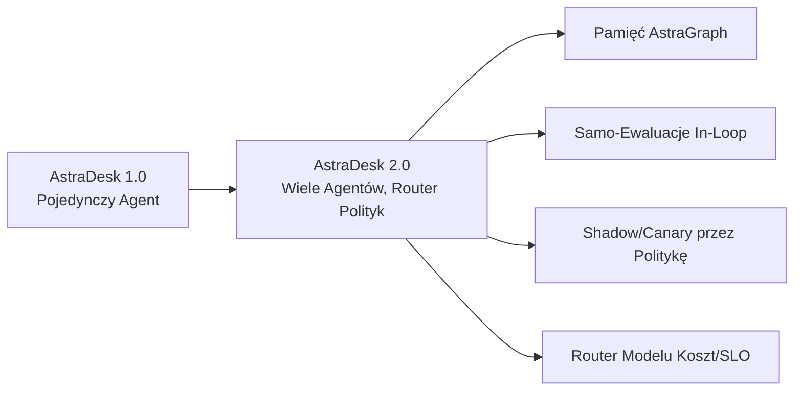
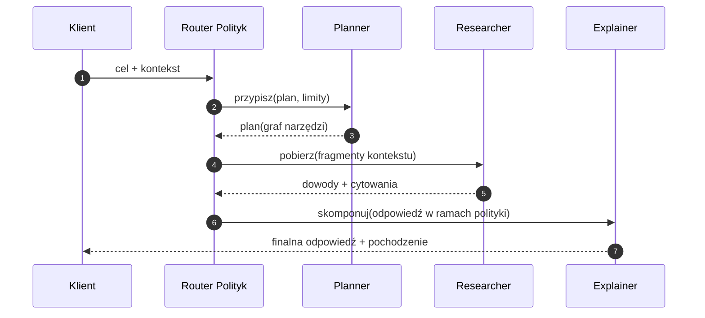
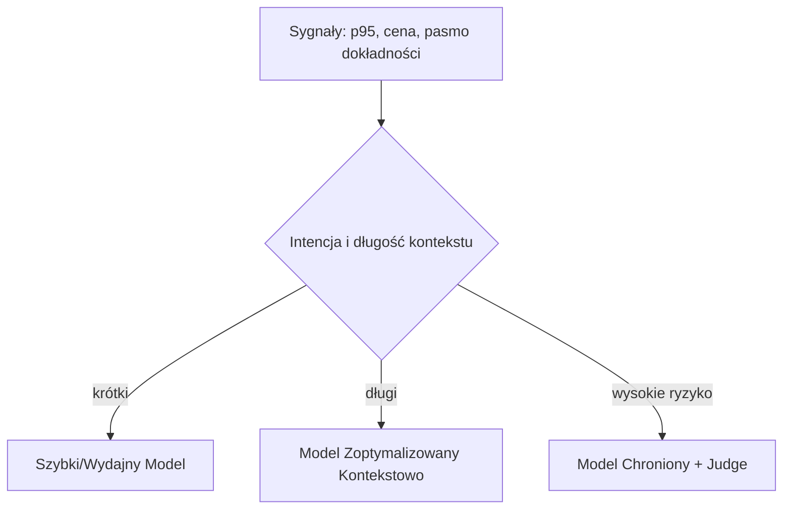

# 10. Przyszła Mapa Drogowa - v2.0 i Dalej

> Ta mapa drogowa przedstawia ewolucję od **pojedynczego agenta (v1.0)** do **systemów wielu agentów świadomych polityk (v2.0+)** z bogatszą pamięcią, autonomicznymi ewaluacjami i routingiem świadomym kosztów. Harmonogram i zakres mogą się zmienić na podstawie dowodów z AstraOps.

<br>

---

## 10.1 Tematy

- **Orkiestracja Wielu Agentów**: zespoły agentów oparte na rolach z politykami na poziomie konwersacji i kredytami.

- **Pamięć AstraGraph**: hybrydowa pamięć vector + graph z czasowym zanikaniem, pochodzeniem i strażnikami retencji.

- **Przepływy Samo-Ewaluacyjne**: LLM-as-a-Judge osadzony jako mikro-polityki; auto-etykietowanie śladów produkcyjnych.

- **Shadow i Canary**: automatyczne uruchamianie challengera na lustrzanym ruchu; rollback przez politykę jeśli SLO się pogarszają.

- **Routing Świadomy Kosztów/SLO**: dynamiczny wybór modelu oparty na p95 opóźnienia, cenie tokenów i pasmach dokładności.

- **Silniejsze Governance**: skatalogowane *intencje*, *prompty* i wersje *narzędzi* jako artefakty wydania pierwszej klasy.

<br>



<br>

<br>

---

## 10.2 Możliwości v2.0 (planowane)

<br>

### 10.2.1 Router Wielu Agentów Świadomy Polityk

- **Orkiestracja**: role Planner, Researcher, Toolsmith i Explainer.

- **Kontrakty Konwersacji**: maks. efekty uboczne narzędzi per rola; budżet kredytów per dialog.

- **Prymitywy Negocjacji**: zaproponuj/zaakceptuj/odrzuć ze zdarzeniami audytu.

<br>



<br>

<br>

---

### 10.2.2 Pamięć AstraGraph

- **Rdzeń Graf**: encje, intencje, dokumenty, narzędzia; krawędzie niosą **świeżość**, **pewność**, **tagi polityk**.

- **Czasowe Zanikanie**: zmniejszaj wagę przestarzałych węzłów; priorytetyzuj świeże dowody.

- **Pochodzenie**: każdy węzeł pamięci niesie digest źródła i politykę retencji.

<br>

**API Pamięci (koncepcja):**

```yaml
# memory/read.yaml
query:
  entities: ["user:X", "app:astradesk"]
  k: 8
  filters:
    - tag: "public"
    - decay_t_half_days: 14
returns: węzły + krawędzie + cytowania
```

<br>

---

### 10.2.3 Przepływy Samo-Ewaluacyjne

- **Kernele Judge**: podłączalne rubryki per zadanie (pomocność, ugruntowanie, bezpieczeństwo).

- **Auto-Etykietowanie**: podzbiór żywych śladów ocenianych; wyniki zasilają datasety regresji.

- **Guardrails**: odrzuć krok komponowania gdy wynik judge < progi.

```python
# pseudo: mikro-bramka judge
scores = judge_kernel(context, draft_answer)
if scores["groundedness"] < 0.80 or scores["safety"] < 0.95:
    raise PolicyDeny("compose_blocked_low_score")
```

<br>

---

### 10.2.4 Shadow, Canary, Auto-Rollback

- **Shadow**: uruchom challengera cicho na lustrzanym ruchu; przechowuj delty w AstraOps.

- **Canary**: stopniowo przesuwaj ruch; ewaluuj żywe KPI vs polityki SLO.

- **Auto-Rollback**: reguła polityki wyzwala rollback przy trwałych regresjach.

<br>

**Reguła polityki (przykład):**

```yaml
# catalog/policies/rollbacks.yaml
rollback:
  if:
    - metric: latency_p95
      op: ">"
      value: 8
      for: "15m"
    - metric: success_rate
      op: "<"
      value: 0.82
      for: "15m"
  action: revert_to: "champion"
```

<br>

---

### 10.2.5 Routing Modelu Świadomy Kosztów/SLO

- **Sygnały**: żywe p95, wskaźnik błędów, tabela cen tokenów.

- **Router**: wybiera poziom modelu per intencja żądania i długość kontekstu.

- **Budżetowanie**: limity kosztów per tenant/agent z miękkimi/twardymi pułapami.

<br>



<br>

<br>

---

## 10.3 Backlog (wybrane pozycje)

- **Introspekcja Schematu Narzędzi** (live): auto-generuj klientów SDK ze schematów MCP.

- **Diff Promptów i Analiza Wpływu**: diff promptów → auto-uruchom podzbiór eval.

- **Hybrydowy Indeks Vector Graph**: Lucene/pgvector + graf właściwości dla KB.

- **Retriever Świadomy PII**: wyszukiwanie które automatycznie redaguje i taguje zakresy.

- **DSL Eval**: mały YAML/JSON do definiowania ewaluacji i sond produkcyjnych.

<br>

---

## 10.4 Ryzyka i Mitygacje

<br>

| Ryzyko                          | Mitygacja                                                    |
| ------------------------------- | ------------------------------------------------------------ |
| Pętle wielu agentów powodują zamieszanie | Kwoty routera, limity kroków, budżety konwersacji      |
| Dryf lub błąd Judge             | Okresowa kalibracja z etykietami ludzkimi; sprawdzenia inter-rater |
| Rozdęcie pamięci                | Czasowe zanikanie + TTL retencji + deduplikacja              |
| Przekroczenie kosztów           | Twarde limity + trasy downgrade + cache tokenów              |
| Złożoność polityk               | Centralny Catalog z testami polityk + wyjaśnialne powody odrzuceń |

<br>

---

## 10.5 Wersjonowanie i Migracja

- **Wersje Semantyczne**: `agent@MAJOR.MINOR.PATCH` dla **Agent**, **Narzędzia**, **Prompty**.

- **Migracja Catalog**: skrypt migracji przepisujący właścicieli, polityki i hashe schematów.

- **Okno Dual-Write**: publikuj do katalogów v1 i v2 podczas przejścia.

<br>

---

## 10.6 Odniesienia Krzyżowe

- Wstecz: [9. MCP Gateway i Pakiety Domenowe](09_mcp_gateway_domain_packs.pl.md)

- Zobacz także: [7. Monitorowanie i Operowanie](07_monitor_operate.pl.md), [8. Bezpieczeństwo i Governance](08_security_governance.pl.md)

<br>
