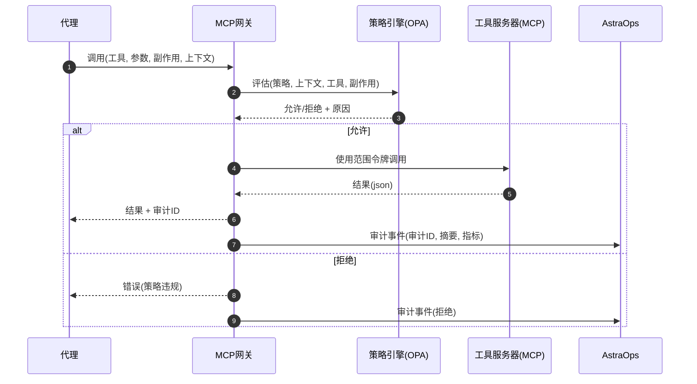
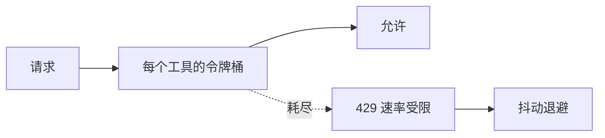

# 9. MCP网关和域包

> AstraDesk将**所有集成**视为具有治理工具/资源/提示的**MCP服务器**。
> **网关**集中处理认证授权、策略、配额、路由和审计。**域包**打包即用型工具。

<br>

---

## 9.1 网关职责 (v1.0)

- **认证/授权**: 代理的OIDC；基于工具的**RBAC**和参数白名单。

- **策略**: OPA/Rego副作用门（`read|write|execute`），PII感知的出口规则。

- **路由**: 环境路由（开发/预生产/生产），故障转移到备用MCP。

- **配额和速率限制**: 每个租户/代理/工具；熔断器。

- **模式注册表**: 每个工具版本的JSON模式；调用时固定哈希值。

- **审计**: 每个工具调用的签名事件（参数摘要+结果摘要）。

<br>



<br>

<br>

---

## 9.2 网关配置 (YAML, 示例)

```yaml
# 文件: gateway/config.yaml
env: "prod"
oidc:
  issuer: "https://auth.company.com"
  audience: "astradesk-gateway"
rate_limits:
  default_rpm: 600
  per_tool:
    kb.search: 2400
    jira.create_issue: 120
policies:
  bundle_url: "s3://astracatalog/policies/bundle.tar.gz"
  deny_on_error: true
tools:
  - name: kb.search
    mcp: "https://mcp.kb.internal"
    side_effect: "read"
    schema_ref: "sha256:8a1c…"
  - name: jira.create_issue
    mcp: "https://mcp.jira.internal"
    side_effect: "write"
    schema_ref: "sha256:f3b0…"
fallbacks:
  kb.search: ["https://mcp.kb.backup"]
audit:
  sink: "kafka://astrabus/audit"
  hash_algo: "sha256"
  retention_days: 365
```

<br>

---

## 9.3 审计事件 (规范)

```json
{
  "audit_id": "gw-2025-10-12T19:22:43Z-7f1c",
  "ts": "2025-10-12T19:22:43Z",
  "agent_id": "support-agent@1.0.1",
  "tool": { "name": "jira.create_issue", "side_effect": "write", "schema_hash": "sha256:f3b0…" },
  "auth": { "actor_type": "agent", "role": "support.agent", "tenant": "acme" },
  "ctx": { "env": "prod", "contains_pii": false, "approval_id": "APR-00123" },
  "args_digest": "sha256:9a62…",
  "result_digest": "sha256:1b7c…",
  "decision": { "allow": true, "policy_bundle": "v2025.10.01" },
  "latency_ms": 412
}
```

<br>

---

## 9.4 错误分类 (网关 → 代理)

<br>

| 代码 | HTTP | 含义 | 操作 |
| ---------------------- | ---: | --------------------------------- | ------------------------------- |
| `policy_violation` | 403 | OPA拒绝（副作用/PII等） | 显示原因，建议升级 |
| `rate_limited` | 429 | 超出配额 | 退避重试 |
| `schema_mismatch` | 422 | 参数与工具模式不匹配 | 修正参数；重新计划 |
| `upstream_unavailable` | 503 | MCP服务器宕机 | 故障转移/排队 |
| `timeout` | 504 | 超出服务器SLA | 减少`top_k`/负载，重试 |
| `auth_failed` | 401 | 令牌无效/过期 | 刷新令牌 |

<br>

---

## 9.5 域包 (v1.0)

<br>

### 9.5.1 支持包

**目的**: 一级支持自动化。

**包含的MCP工具**

- `kb.search (read)` - 知识库/常见问题检索（支持向量/图后端）。

- `jira.create_issue (write)` - 创建带标签/优先级的工单（需要审批）。

- `slack.post_message (write)` - 使用模板发布到频道（需要审批）。

<br>

**模式（摘录）**

```json
{
  "$id": "mcp/schemas/slack.post_message.schema.json",
  "$schema": "https://json-schema.org/draft/2020-12/schema",
  "title": "slack.post_message",
  "type": "object",
  "properties": {
    "channel": { "type": "string", "pattern": "^#[a-z0-9_-]+$" },
    "text":    { "type": "string", "minLength": 1 }
  },
  "required": ["channel","text"],
  "additionalProperties": false
}
```

<br>

**包安装（目录清单）**

```yaml
# 文件: catalog/packs/support.yaml
pack: support
version: 1.0.0
owners: ["support.platform@company.com"]
tools:
  - name: kb.search
    side_effect: read
    schema_ref: "sha256:8a1c…"
  - name: jira.create_issue
    side_effect: write
    schema_ref: "sha256:f3b0…"
  - name: slack.post_message
    side_effect: write
    schema_ref: "sha256:7aa9…"
policies:
  require_approval_for:
    - jira.create_issue
    - slack.post_message
```

<br>

---

### 9.5.2 运维包

**目的**: 带防护措施的运维分类。

**包含的MCP工具**

- `metrics.query (read)` - 查询Prometheus的SLO。

- `remediation.seq (execute)` - 已批准的幂等操作手册（例如，扩展部署）。

<br>

**修复描述符**

```yaml
# 文件: ops/remediations/scale_support_agent.yaml
id: scale_support_agent
owner: "ops@company.com"
prechecks:
  - metric: "histogram_quantile(0.95, ... ) > 8"
  - tool: "k8s.get_deployment"         # 只读健全性检查
steps:
  - tool: "k8s.patch_deployment"       # 执行（需要变更记录）
    args:
      name: "support-agent"
      replicas: 3
postchecks:
  - metric: "histogram_quantile(0.95, ... ) <= 8"
approvals:
  required: true
  change_record: "INC-2025-00123"
```

<br>

---

## 9.6 OpenAPI垫片（可选）

为**非MCP客户端**暴露小型REST接口；内部仍调用MCP。

```yaml
openapi: 3.1.0
info: { title: "AstraDesk网关垫片", version: "1.2.0" }
paths:
  /invoke:
    post:
      summary: 通过网关调用工具
      requestBody:
        required: true
        content:
          application/json:
            schema:
              type: object
              required: [tool, args, side_effect]
              properties:
                tool: { type: string }
                side_effect: { type: string, enum: [read, write, execute] }
                args: { type: object, additionalProperties: true }
      responses:
        "200": { description: "工具结果" }
        "4XX": { description: "策略/模式错误" }
        "5XX": { description: "上游错误" }
```

<br>

---

## 9.7 速率限制和配额（设计）

- **层级**: 租户 → 代理 → 工具。

- **窗口**: 固定或令牌桶；每个环境。

- **突发控制**: 连续失败时熔断器打开。

- **退避**: 发送给代理的抖动指数退避指导。

<br>



<br>

<br>

---

## 9.8 安全说明

- 所有**写入/执行**工具必须在上下文中包含**approval_id**或**change_record**。

- **PII标志**从入口清理器传播到网关；阻止`external.*`工具。

- **模式固定**: 代理包含`schema_hash`；网关在不匹配时拒绝。

<br>

---

## 9.9 运营仪表板（建议）

- **网关**: RPS、错误率、p95、开启的电路、按策略规则的拒绝原因。

- **工具**: 按工具版本的成功率、延迟分布、备用命中。

- **审计**: 按代理/版本的顶级写入操作；随时间的审批。

<br>

---

## 9.10 交叉引用

- 下一步: [10. 未来路线图](10_future_roadmap.md)

- 上一步: [8. 安全与治理](08_security_governance.md)

- 另请参阅: [7. 监控与运营](07_monitor_operate.md), [4. 构建阶段](04_build_phase.md)

<br>